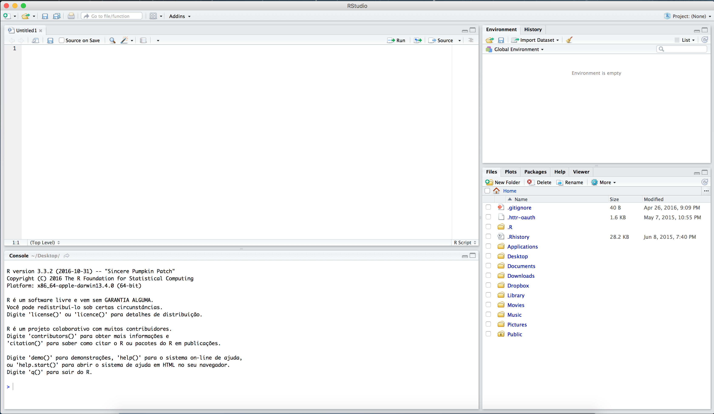
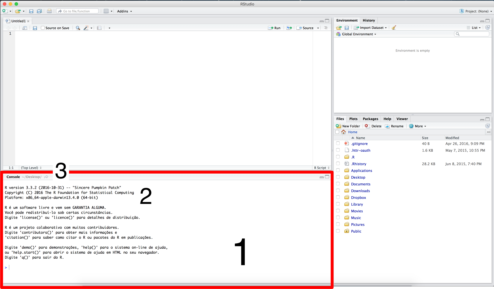
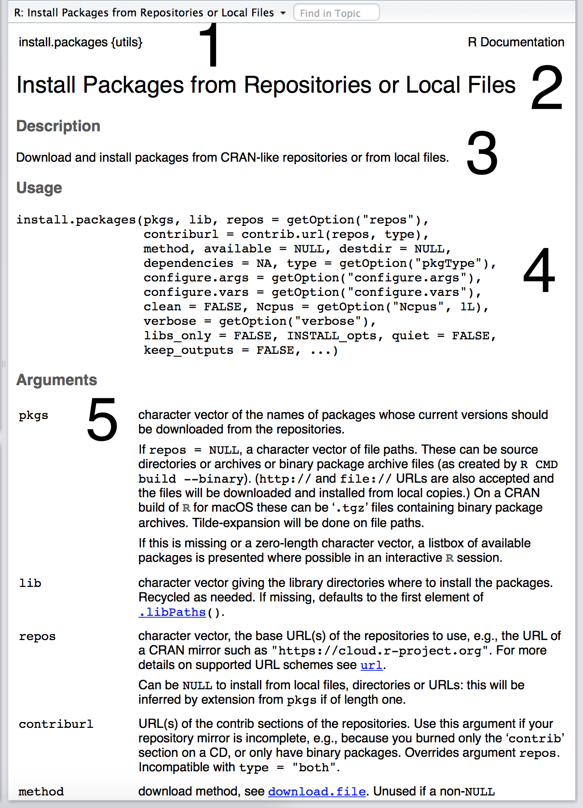

<style type="text/css">
body, td {
   font-size: 18px;
}
code.r{
  font-size: 16px;
}
pre {
  font-size: 16px
}
h1,h2,h3,h4,h5,h6{
  font-size: 24pt;
}
</style>

# Elementos da Aula

1. Introdução ao RStudio;
2. Instalação de Pacotes;
3. Leitura de arquivos de Ajuda;
4. Algumas dicas iniciais do RStudio.

## Introdução ao RStudio

* O RStudio é uma __interface__ usada para facilitar a sua vida ao utilizar a linguagem R.  
* __Ele não é o R em si!__
* Outras opções existem, como o Tinn-R e o Microsoft R.  
* A interface gráfica básica do RStudio.

<center></img></center>  

### O Console

* É a janela de execução do R, similar a abrir somente o programa base do R.
* Nesta área você encontra:
    1. O console do R;
    2. A versão do R que está sendo executada;
    3. O diretório de trabalho da sessão.

<center></img></center>  

### O Projeto

* Podemos organizar todo o trabalho que estamos fazendo ao redor de um __projeto__.
* Um projeto vai conter todos os arquivos, scripts e figuras necessários para realizarmos uma tarefa (manuscrito, dissertação, tese, análise,...).
* Existem muitas vantagens em se iniciar um projeto para cada tarefa que estamos fazendo - uma delas é que o diretório utilizado para carregar r salvar arquivos fica sendo consistente entre qualquer computador em que você abrir o projeto.

<center></img></center>  

### O Script

* É sempre bom escrevermos o código que queremos usar em uma tarefa em um script e, a partir dele, enviar os comandos para o console.
* Um script pode conter o código e anotações utilizadas para gerar qualquer tipo de computação.
* Sempre use um script para manter o registro de tudo o que você está fazendo ao realizar uma tarefa.
* Nesta área você encontra:
    1. A janela do script;
    2. O botão _Run_, usado para enviar o comando do script ao console;
    3. Um botão para _salvar_ o script em um diretório de sua escolha (ou salvar as alterações feitas nele);
    4. Um botão de _busca_ e/ou _substituição_;
    5. Uma aba para facilitar a navegação entre as partes ("capítulos") do seu script.

<center></img></center>  

### Informações relacionadas à sessão

* Todas informações relacionadas aos arquivos e objetos existentes em uma sessão (__1__, aba _"Environment"_) e todo o histórico de comandos executados (__2__, aba _"History"_) são encontrados aqui.
* Na aba _"Environment"_, você encontra utilidades como:
    3. Um botão para excluir todos os arquivos e objetos carregados/criados;
    4. Um botão para importar tabelas para o ambiente (_"Import Dataset"_; __uso não recomendado__).

<center></img></center>  

### Outras funcionalidades presentes do RStudio

* Aqui estão concentradas algumas funcionalidades importantes do RStudio e do R.
    1. Aba _"Files"_
        a. Contém todos os arquivos em um diretório;
        b. O __".."__ na primeira linha pode ser utilizado para mover ao diretório acima do que você observa;
    2. Ainda na aba _"Files"_, existem botões que você pode usar para:
        a. Criar uma nova pasta em um diretório (_"New folder"_);
        b. Deletar um arquivo ou pasta (_"Delete"_);
        c. Renomear um arquivo ou pasta (_"Rename"_).
    3. Toda vez que você criar um gráfico ou figura, ele será apresentado na aba _"Plots"_; você pode salvar esta figura diretamente a partir da aba, mas isso não é muito recomendado (veremos isso nas aulas de `base::plot` e `ggplot2`);
    4. A partir da aba _"Packages"_ você pode instalar, fazer o update, carregar e/ou acessar o conteúdo de um pacote.
    5. Todo e qualquer arquivo de ajuda de uma função ou pacote é apresentado e descrito na aba _"Help"_.

<center></img></center>  

## Instalação de Pacotes

* Um pacote do R contém um conjunto de __funções__ que auxiliam na execução de determinadas tarefas (carregamento de dados, criação de gráficos, análises estatísticas e etc). 
* Um exemplo de função é o `install.packages`, utilizado para instalar novos pacotes ao seu R.
* Uma função pode levar inúmeros __argumentos__.
* Um argumento são valores ou opções necessárias para a execução de uma função.

```{r}
args(install.packages)
```

* Vamos instalar um pacote para exemplificar o uso da função `install.packages`:

```{r eval=FALSE}
install.packages(pkgs = "taxize", dependencies = TRUE)
```

## Leitura de arquivos de Ajuda

* Para pedir ajuda sobre uma função você pode usar:
    1. Método específico para funções:
        + `?nome_da_funcao`;
        + `help(topic = "nome_da_funcao", package = "nome_do_pacote_em_que_esta_a_funcao")`;
    2. Método específico para pacotes:
        + `help(package = "nome_do_pacote_em_que_esta_a_funcao")`;
    3. Ajuda de forma generalizada sobre um pacote ou função:
        + `??nome_do_pacote_ou_funcao`;
        + O pacote `sos` tem um método de busca bem legal também.
* Todo arquivo de ajuda de uma função é separado em:
    1. Nome da função e pacote no qual ela está localizada;
    2. Título da função;
    3. Descrição geral da função
    4. Forma de uso da função, contendo a sua chamada e todos os argumentos existentes nelas;
    5. Descrição detalhada de todos os argumentos usados pela função;
    
    <center></img></center>  
    
    6. Descrição do funcionamento geral da função, consequências do uso de um ou outro tipo de opção no uso dos argumentos, discussão geral sobre a teoria por trás de cada argumento e etc;
    
    <center></img></center>  
    
    7. Notas gerais sobre o funcionamento da função;
    8. Sugestões de outras funções correlatas;
    9. Exemplo prático do uso da função.

<center></img></center>  

* __Assim como qualquer outra língua, você precisa saber o básico dela para entender o que está escrito.__

## Algumas dicas iniciais do RStudio

1. Use sempre um projeto para organizar os seus scripts;
2. Organize seu script em "capítulos" - para isso, utilize o atalho do teclado: `Command + Shift + r` no MAC ou `Control + Shift + r` no Windows;
3. Adicione comentários ao seu script sempre que puder, através do `#`.
4. Ao invés de ficar pressionando o botão `Run` para enviar os comandos do script para o console, utilize `Command + Enter` no MAC ou `Control + Enter` no Windows;
5. Para ver os últimos comandos lançados no console, coloque o cursor lá e utilize `Command + Seta para cima` no MAC ou `Control + Seta para cima` no Windows;
6. Na dúvida sobre uma função? Coloque o curso em cima dela (no console ou no script) e pressione `Function + F1` no MAC ou `F1` no Windows;
6. Use a ferramenta de auto-completar do RStudio: comece a escrever o nome da função que você deseja, aperte `Tab` e navegue pelas opções através das setas.
7. Na dúvida também sobre os argumentos que existem em uma função? Dentro do parenteses que descreve seus argumentos, pressione `Tab`, navegue pela lista de argumentos e veja uma pequena descrição do que cada um deles deve ser.
8. Quer apagar tudo que está escrito no seu console? Use `Control + L` no MAC ou no Windows.

## Exercício

1. Instale os pacotes `readr` e `readxl`, além de todas as suas dependencias.
