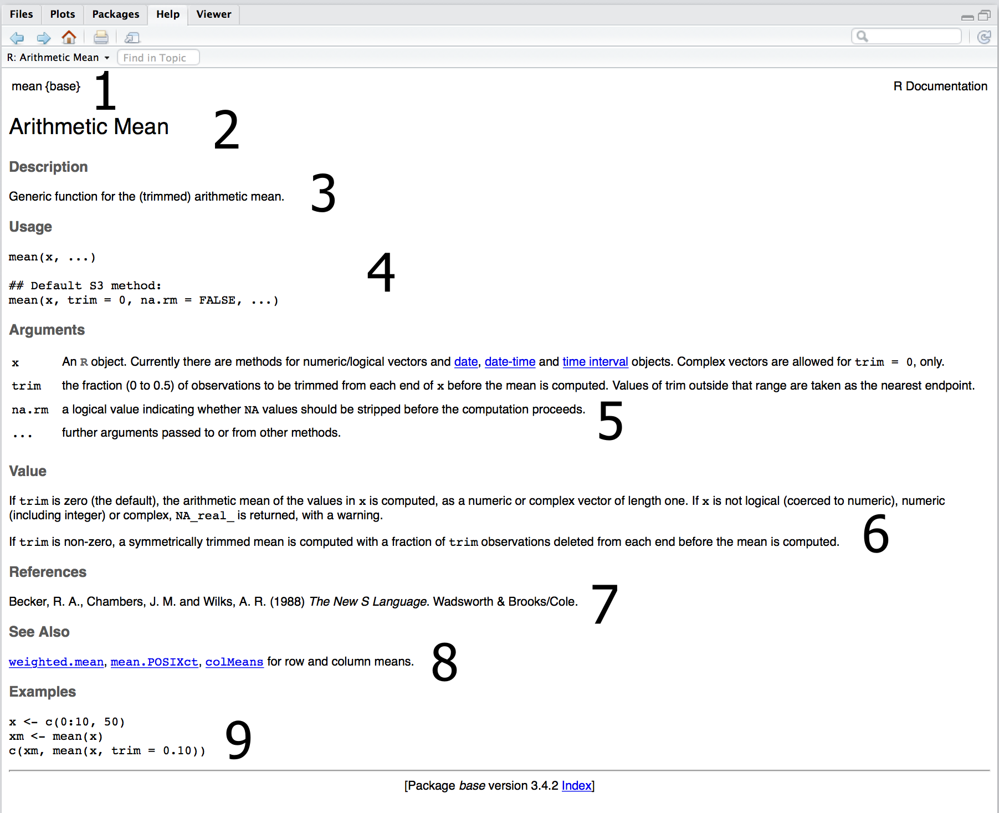
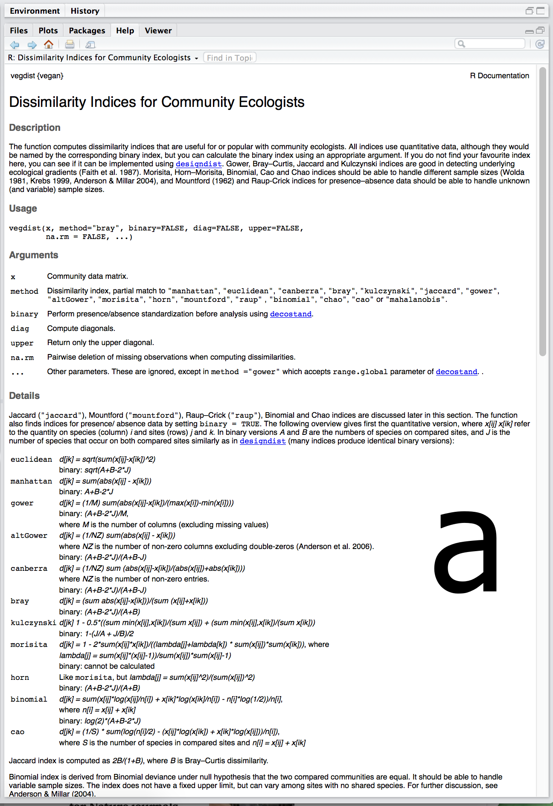
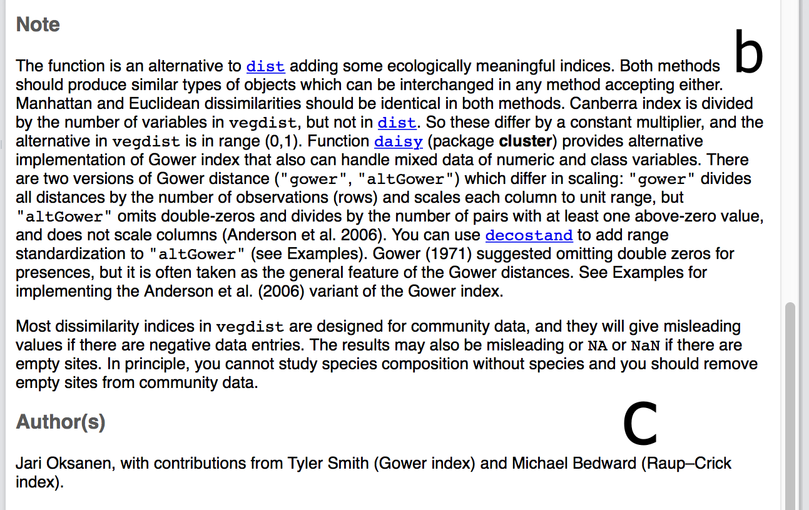

<style type="text/css">
body, td {
   font-size: 18px;
}
code.r{
  font-size: 16px;
}
pre {
  font-size: 16px
}
h1,h2,h3,h4,h5,h6{
  font-size: 24pt;
}
</style>

# Elementos da Aula

1. [Operações matemáticas básicas](#anchor1)
2. [Criação de objetos](#anchor2)
3. [O que são funções?](#anchor3)
4. [Funcionamento básico de uma função](#anchor4)
5. [As funções na linguagem R](#anchor5)
6. [Instalação de pacotes](#anchor6)
7. [Suas principais fontes de erro serão...](#anchor7)
8. Lista de Exercícios
    + [Exercício 1](#anchor8)
    + [Exercício 2](#anchor9)
    + [Exercício 3](#anchor10)
    + [Exercício 4](#anchor11)
    + [Exercício 5](#anchor12)

## 1. Operações matemáticas básicas no R {#anchor1}

* O R pode ser usado para fazer operações matemáticas básicas:
    
```{r}
# soma
5 + 5 
# subtração
10 - 5 
# divisão
10 / 2 
# multiplicação
5 * 2 
```

* Para fazer operações matemáticas um pouco mais complexas:

```{r}
# raiz cubica
15^(1/3)
# elevar a um expoente
5^2
# número inteiro de uma divisão
15 %/% 2
```

* O R também já tem valores de certas constantes dentro de seu ambiente:

```{r}
# pi
pi 
# letras do alfabeto
letters
LETTERS
# nomes dos meses
month.name
```

---

#### Exercício 1 {#anchor8}

a. Qual a raiz quadrada de 33?

---

## 2. Criação de objetos {#anchor2}

* Pode ser muito repetitivo ter que ficar digitando constantemente uma operação para obter um resultado; as vezes, isto não é só repetitivo, mas a escrita do código pode ser demasiada longa e enviesada ao erro;
* Para facilitar a sua vida, você pode criar __objetos__ para armazenar uma determinada operação, comando, arquivos ou outros objetos.
* Você __atribui__ um __valor__ a um objeto através dos operadores `<-` ou `=` (a primeira forma é a mais fácil de ser interpretada; em inglês, `assign`).

```{r}
resultado <- 5 + 5
resultado = 5 + 5
```

* Assim, para ver o resultado do objeto criado basta "chamar" ele:
```{r}
resultado
```

* Outra opção para criar um objeto e ver o que ele contém imediatamente é:
```{r}
(resultado <- 5 + 5)
```

* Existe um atalho no RStudio para adicionar o operador de atribuição de forma mais fácil: `Option + -` no MAC ou `Alt + -` no Windows.

---

#### Exercício 2 {#anchor9}

a. Divida o objeto `resultado` pela raiz quadrada de 4 e armazene esta operação no objeto `resultado`;
b. Sem olhar, qual o valor armazenado no objeto `resultado`?

---

## 3. O que são funções? {#anchor3}

* Uma função representa um conjunto de ações que devem ser feitas para originar um resultado, e são os blocos fundamentais do R: toda e qualquer tarefa é realizada através delas;
* Toda função é composta por um ou mais __argumentos__, que controlam e/ou determinam o que a função faz e como ela deve se comportar;  
* Um argumento são valores ou opções necessárias para a execução de uma função.
* Por exemplo, muitas das funções que realizam operações matemáticas recebem apenas um ou dois argumentos.

```{r}
# log
log(x = 15)
# exponencial
exp(x = 2.70805)
# raiz quadradra
sqrt(x = 15)
# valor absoluto
abs(x = -5)
# fatorial: 5!
factorial(x = 5)
# combinações: retirar k elementos de n possibilidades
choose(n = 5, k = 2)
# coseno
cos(x = 73)
# seno
sin(x = 92)
# tangente
tan(x = 3)
# arcoseno
asin(x = 0.8)
```

---

#### Exercício 3 {#anchor10}

a. Qual o resultado da divisão entre a raiz quadrada de 2019 e o arcoseno de 0.43?

---

## 4. Funcionamento básico de uma função {#anchor4}

* Toda função é criada através de outra função, chamada `function`.
* Todas as funções possuem três partes:
    1. O __código__ que compõem o corpo da função;
    2. Uma lista de __argumentos__, que controlam de que forma você pode usar uma função;
    3. Um "mapa", com a localização das variáveis usadas na função (inclusive, outras funções e objetos) - em outras palavras, onde a função reside.

```{r eval=FALSE}
## uma função para calcular a riqueza de espécies em uma ilha qualquer: S = c.a^z
function(a) {
  2 * a ^ 0.4
}
```

* É importante atribuirmos o processamento de uma função a um objeto, a fim de que ela possa gerar nos demonstrar um resultado.

```{r}
riqueza <- function(a) {
  2 * a ^ 0.4
}
```

* Agora podemos descobrir o valor da riqueza em espécies para a ilha com área de 1.2 km².

```{r}
riqueza(a = 1.2)
```

* A função acima leva apenas um argumento, __a__, que representa a área da ilha em km². Note, no entanto, que nós estamos deixando a escolha do valor de __a__ livre para o usuário. Caso o usuário não define um valor de __a__ a função simplesmente não vai ser executada!

```{r eval=FALSE}
## tente rodar
riqueza()
```

* __Dica do R:__ você sabe a diferença entre um `error`, `warning` e uma `message`?
    + `error`: uma indicação de que um problema fatal ocorreu, levando à parada da execução da função;
    + `warning`: uma indicação de que algo de errado aconteceu, mas que não é necessariamente fatal - desta forma, a execução da função prossegue (_e.g._, `log(x = -2)`);
    + `message`: uma mensagem ou notificação genérica, que não tem haver com um erro ou problema na execução da função - tudo ocorre de forma natural.

* `error` vs `warning` vs `message`: 
    1. ordem de perigo: `warning` > `message` > `error` (__melhor não fazer, do que fazer mal feito__).
    2. ordem de desespero de alguém que está iniciando: `warning` = `message` = `error`.

* Entretanto, é possível que nós criemos funções que possuam valores 'pré-informados' para determinados argumentos. Assim, o usuário pode utilizar a função com base nestes valores-padrão ou um outro valor de sua preferência.

```{r}
## informando para a funcao um valor padrao de a
riqueza <- function(a = 1.2) {
  2 * a ^ 0.4
}

## rodando a funcao sem especificar o valor de a
riqueza()

## rodando a funcao especificando um valor de a diferente
riqueza(a = 33)
```

* Toda variável não-definida dentro do corpo da função deve ter seu valor determinado dentro da lista de argumentos, enquanto que a adição de argumentos que não tem utilidade dentro da função também não modificam o seu funcionamento.

```{r}
## adicionando um argumento z, sem correspondencia dentro da funcao
riqueza <- function(a = 1.2, z = 2) {
  2 * a ^ 0.4
}

## utilizando a funcao em seu novo formato - mesmo resultado em ambos os casos
riqueza(a = 3, z = 2)
riqueza(a = 3, z = 10)
```

---

#### Exercício 4 {#anchor11}

a. Conserte a função acima de forma que mudanças no valor de `z` sejam refletidas nos resultados da função;  
b. Modifique a funcao acima de forma que todos os valores para o cálculo da riqueza de espécies seja fornecida pelo usuário.  

---

## 5. As funções na linguagem R {#anchor5}

* Existem funções já escritas para grande parte das tarefas que você precisará executar utilizando a linguagem R.
* Podemos obter mais informações sobre a existência e o que fazem cada um das funções de várias formas:
    1. Método específico para funções:
        + `?nome_da_funcao`;
        + `help(topic = "nome_da_funcao", package = "nome_do_pacote_em_que_esta_a_funcao")`;
    2. Método específico para pacotes:
        + `help(package = "nome_do_pacote_em_que_esta_a_funcao")`;
    3. Ajuda de forma generalizada sobre um pacote ou função:
        + `??nome_do_pacote_ou_funcao`;
        + O pacote `sos` tem um método de busca bem legal também.
* Todo arquivo de ajuda de uma função é separado em:
    1. Nome da função e pacote no qual ela está localizada;
    2. Título da função;
    3. Descrição geral da função
    4. Forma de uso da função, contendo a sua chamada e todos os argumentos existentes nelas;
    5. Descrição detalhada de todos os argumentos usados pela função;
    6. Outras informações relevantes sobre os dados que são carregados na função e/ou os dados que ela te retorna;
    7. Referências bibliográficas relacionadas à função;
    8. Sugestões de funções correlatas;
    9. Exemplo prático do uso da função.

   <center></img></center>  

* O arquivo de ajuda de uma função também pode conter (a) uma descrição detalhada do funcionamento da função, consequências do uso de um ou outro tipo de opção no uso dos argumentos, discussão geral sobre a teoria por trás de cada argumento e etc.

   <center></img></center>  
    
        
* E também (b) notas gerais sobre o funcionamento da função e (c) o(s) nome(s) dx(s) autorx(s) da função.
  
  
   <center></img></center>  

* Nem todos os argumento de uma função são números: alguns deles são argumentos lógicos (`TRUE` ou `FALSE`) ou caracteres (_i.e._, palavras).

```{r}
args(read.table)
```

* Como muitos dos argumentos de uma função já são pré-determinados, __você não precisa determinar todos eles sem pre que as usar__, __mas precisa saber o que deve ser selecionado para gerar o resultado que você deseja__.
* Além disso,você pode especificar os argumentos de uma função através de seu nome completo, nome parcial ou posição do argumento dentro da lista de argumentos de uma função. Ou seja:

```{r eval=FALSE}
# por nome completo
read.table(file = "nome_do_arquivo", header = TRUE, sep = ",")
# por posição
read.table("nome_do_arquivo", TRUE, ",")
# por nome parcial
read.table("nome_do_arquivo", head = TRUE, ",")
# por nome completo, mudando a posição
read.table(sep = ",", header = TRUE, file = "nome_do_arquivo")
```

* __Recomendação:__ é bom manter a boa prática e manter a sequência dos argumentos em ordem e, sempre que possível, adicionar o nome completo do argumento.

## 6. Instalação de Pacotes {#anchor6}

* Nem todas as funções que você vai precisar usar estarão prontamente disponíveis no R quando você instalar ele, e muitas delas só estarão disponível quando você baixar e executar alguns __pacotes__.  
* Um pacote do R contém um conjunto de funções que auxiliam na execução de determinadas tarefas (carregamento de dados, criação de gráficos, análises estatísticas e etc). 
* Podemos instalar pacotes através da função `install.packages`.
* Vamos instalar um pacote para exemplificar o uso da função `install.packages`:

```{r eval=FALSE}
install.packages(pkgs = "gapminder", dependencies = TRUE)
```

---

## Exercício 5 {#anchor12}

a. Instale os pacotes `RColorBrewer` e `viridis`, além de todas as suas dependencias.

---

## 7. Suas principais fonte de erro serão... {#anchor7}

* Você é o seu pior inimigo:
    1. Erros de digitação ao chamar um objeto ou função (e.g., `read.tab1e` ou `readtable` ao invés de `read.table`);
    2. Esquecer de criar um objeto antes de rodar uma função;
    3. Especificar um argumento que não existe na função;
    4. Especificar o argumento certo de forma errada (adicionar um número onde na realidade deveria ser algo como VERDADEIRO/FALSE);
    5. Especificar o argumento certo mas com o tipo de objeto errado (como veremos, existem muitos tipos de objetos no ambiente R);
    6. Misturar letras e números no mesmo tipo de objeto (veremos mais isso ao longo do curso).

* __Boa prática__: 
    + Apague objetos que você não vá usar mais em uma sessão - `rm(objeto)`;
    + Evite salvar a área de trabalho ao sair do R (casos especiais justificam salvá-lo);
    + Ao iniciar uma sessão, limpe tudo que está no ambiente global do R - `rm(list = ls(all = TRUE))`.

* __Dica do RStudio:__
    + Use a ferramenta de auto-completar do RStudio: comece a escrever o nome da função que você deseja, aperte `Tab` e navegue pelas opções através das setas;  
    + Na dúvida também sobre os argumentos que existem em uma função? Dentro do parenteses que descreve seus argumentos, pressione `Tab`, navegue pela lista de argumentos e veja uma pequena descrição do que cada um deles deve ser.  
    