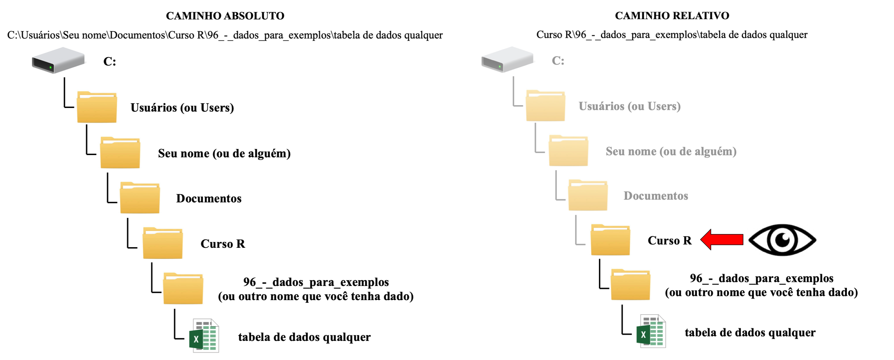

<style type="text/css">
body, td {
   font-size: 18px;
   text-align: justify;
}
code.r{
  font-size: 16px;
}
pre {
  font-size: 16px
}
h1,h2,h3,h4,h5,h6{
  font-size: 24pt;
}
</style>

# Elementos da Aula

1. [Preparando uma tabela de dados](#anchor1)
2. [Caminhos absolutos _vs_ relativos](#anchor2)
3. [Importando tabelas em `.csv` e `.txt`](#anchor3)
4. [`data.frame` e `tibble`](#anchor4)
5. [Importando tabelas do Excel](#anchor5)
6. [Importando listas](#anchor6)
7. [Exportando `data.frame` e listas](#anchor7)
8. Exercícios
    + [Exercício 1](#anchor8)
    + [Exercício 2](#anchor9)
    + [Exercício 3](#anchor10)
    + [Exercício 4](#anchor11)
    + [Exercício 5](#anchor12)

## 1. Preparando uma tabela de dados {#anchor1}

* Uma parte fundamental do que fazemos ao utilizar o R envolve importar um conjunto de dados de uma planilha para a sessão de trabalho;
* Neste sentido, é bastante provável que os arquivos que desejamos importar estarão em um ou mais dos seguintes formatos e suas extensões:
    + arquivos de Excel com extensão: `.xlsx` e .`xls`;
    + arquivos de texto separado por tabulação: `.txt`;
    + arquivos separados por vírgulas: `.csv`;
    + ...
* Entretanto, é extremamente importante que a planilha que vamos utilizar esteja formatada corretamente, de forma que as informações necessárias sejam apresentadas ao computador da forma como ele melhor as entende: visão humana _vs_ visão da máquina.
* __A maior parte dos erros de leitura de dados ocorrem por conta de erros na criação e edição da planilha que ser importar__.  
    1. __"," no lugar de "." para separar decimais:__ editável através de um argumento nas funções de leitura de dados;  
    2. __espaços entre palavras nos títulos e células:__ isto era uma problema nas versões anteriores do R, mas aparentemente foi resolvido;  
    3. __espaços no final de um célula:__ durante o preenchimento das planilhas podem haver células fantasmas;  
    4. __células vazias:__ uma célula pode estar vazia por dois motivos, e é importante codificar de forma correta:
        + Não existe observação feita para aquela informação: adicionar __NA__ (not available); __não__ usar "ND" ou "N/A".
        + A observação foi feita, mas o valor foi zero: adicionar o valor 0.
    5. __acentos e outras coisas do português:__ lembre-se que computadores não entendem português tão bem e, tampouco, o R - eles podem se confudir com os acentos que usamos nas palavras (problema nas versões anteriores, mas melhorando - entretanto, não abuse);  
    6. __caracteres especiais:__ assim como no item anterior, evite usar caracteres especiais nas suas planilhas, como "ç" e símbolo gregos (como $\mu$, para simbolizar micro) (problema nas versões anteriores, mas melhorando - entretanto, não abuse);  
    7. __linhas com comentários antes de iniciar a apresentação dos dados:__ editável através de um argumento nas funções de leitura de dados.

> Tabelar os dados de forma correta é reduzir drasticamente as chances de ter um erro ao carregar uma planilha de dados.

## 2. Caminhos absolutos _vs_ caminhos relativos {#anchor2}

* Carregar um conjunto de dados no R não é um problema quando: 
    + somos um único indivíduo mexendo em conjunto de dados;
    + estamos trabalhando em um conjunto de dados utilizando em um único computador;
    + estamos trabalhando em um conjunto de dados durante um curto intervalo de tempo (~ 1 ano). 
* Entretanto, nem sempre teremos essas situações tão bem controladas durante a nossa vida, uma vez que (1) você pode estar usando mais de um computador nesse momento, (2) ou utilizar um computador diferente no futuro ou, ainda, (3) estar trabalhando junto de outra pessoa.
* Por que isso é um problema?
    + O 'caminho' (_path_) que aponta para um determinado arquivo difere de pessoa para pessoa ou computador para computador;
    + Depois de algum tempo você dificilmente vai lembrar em qual diretório estava que arquivo e/ou que arquivo é usado em que script e para o quê.
* Algumas soluções para remediar estes problemas potenciais:
    + __Nunca__ usar o `setwd(<novo_diretorio>)` ou `file.choose` para a importação dos dados;  
    + Utilizar os __projetos__ do RStudio para organizar o seu trabalho;  
    + Utilizar __caminhos relativos__ ao invés de __caminhos absolutos__ para importar um conjunto de dados.  
       + __Caminho absoluto:__ descreve o caminho até um arquivo desde a raiz do computador;  
       + __Caminho relativo:__ descreve o caminho até um arquivo a partir do diretório de trabalho atual.  

<center></img></center>  


> __Importante:__ nunca, em hipótese alguma, use o file.choose para abrir um arquivo! Caso você mude de computador, mude o nome do arquivo, se distraia ou simplesmente passe muito tempo desde que você usou o script pela última vez, você não se lembrará, não achará o arquivo, ou usará o arquivo incorreto. Isso é totalmente perigoso e contra-produtivo! Tenha boas práticas!

> Não se esqueça: tente sempre trabalhar usando os projetos do RStudio!  

---

### Exercício 1 {#anchor8}

1. Qual o caminho absoluto até o arquivo desta aula no seu computador?
2. Qual o caminho relativo para este mesmo arquivo?
    + __Dica__: utilize a função `getwd` para visualizar os caminhos, e preste atenção ao caminho indicado debaixo da aba 'Console'.  

---

## 3. Importando tabelas em `.csv` e `.txt` {#anchor3}

* Existem três principais formatos que utilizamos para salvar uma tabela de dados:
    + arquivos de texto separado por tabulação: `.txt`;
    + arquivos separados por vírgulas: `.csv`;
    + arquivos de Excel: `.xlsx` e .`xls`;
* O R dispõem de diversos pacotes e funções capazes de importar estes dados e, também, exportar informações nestes mesmos formatos. A `base` do R possui uma variedade de funções para tal, mas recentemente os pacotes `readr` e `readxl` têm se mostrado mais úteis, rápidos e menos propensos a apresentar erros de leitura.
* Estes e muitos outros pacotes de leitura de dados possuem funções com estruturas muito similares para a importação e exportação de dados:
    + `read.<extensão>`, para importar (na `base`, `read.<extensão>`);  
    + `write_<extensão>`, para exportar (na `base`, `write.<extensão>`).

* Vamos examinar a função `read.csv` que é utilizada para carregar um conjunto de dados com extensão `.csv` (_comma-separated values_).

```{r}
# da base do R
args(read.csv)
```

* Vamos utilizar esta função para carregar um conjunto de dados. Todavia, é necessário garantirmos que (1) determinamos que o separador entre colunas é o ";" ao invés da "," (isto difere de computador para computador - alguns salvam `.csv` separado por ";" como padrão, enquanto outros usam ",") e (2) ele entenda que a primeira linha corresponda aos nomes das colunas.
* __Importante:__ é sempre uma boa ideia atribuir a um objeto os dados que você está carregando; caso você não o faço, os dados vão 'existir' dentro da sessão de trabalho somente quando você executar a linha de comando que serve para carregar eles. Com a atribuição dos dados a um objeto, eles vão 'existir' dentro da sessão de trabalho até que você a encerre (ou remova eles).

```{r echo=FALSE, message=FALSE}
dados_climaticos <- read.csv(file = "../96_-_dados_para_exemplos/dados climaticos.csv", header = TRUE)
```

```{r eval=FALSE}
## use um ou outro:
# se o seu computador entender o csv como separado por vírgula
dados_climaticos <- read.csv(file = "dados climaticos.csv", header = TRUE)
dados_climaticos
# se o seu computador entender o csv como separado por ponto-e-vírgula
dados_climaticos <- read.csv(file = "dados climaticos.csv", header = TRUE, sep = ";")
dados_climaticos
```

* __Dica do RStudio:__ você não precisa ficar vendo no Explorer/Finder o caminho para chegar ao arquivo que você quer carregar. Basta:
    + Abrir aspas após adicionar `file = `;
    + Pressionar `Tab` e usar a seta para cima ou para baixa para selecionar o diretório;
    + Pressionar `Tab` novamente para entrar no diretório;
    + Caso o diretório que você deseja esteja "acima" daquele que você está, basta adicionar `../` no início do caminho e apertar `Tab` - você verá o diretório acima; caso o diretório alvo esteja ainda mais acima, é só adicionar mais um `../` na frente do que você já usou (e.g., `../../`);
    + Caso você queira iniciar a busca diretamente a partir da raíz do seu computador, é só começar a preencher o caminho com `/` e ir apertando `Tab`.

* Podemos verificar as primeiras linhas de uma tabela que carregamos pela função `head`:

```{r}
head(x = dados_climaticos)
```

* E também podemos verificar as últimas linhas desta tabela pela função `tail`:

```{r}
tail(x = dados_climaticos)
```

* Além disso, podemos verificar a estrutura do conjunto de dados que carregamos com a função `str`:

```{r}
str(dados_climaticos)
```

* Podemos também ter acesso à características específicas deste conjunto de dados, como o número de linhas e colunas:

```{r}
# numero de dimensoes da planilha (linhas e dados)
dim(dados_climaticos)
# numero de colunas
ncol(dados_climaticos)
# numero de linhas
nrow(dados_climaticos)
```

* E também podemos verificar os nomes das linhas e colunas.
```{r}
# nomes das colunas
colnames(dados_climaticos)
# nomes das linhas
rownames(dados_climaticos)
```

* Outra forma de ver os nomes das linhas de um data.frame, ou o nome das observações em um vetor ou das sub-listas de uma lista é através da função `names`.

```{r}
# nomes das colunas do data.frame dados
# outra forma de ver isso: nome dos vetores que compõem o data.frame dados
names(x = dados_climaticos)
```

* De forma análoga à função `read.csv` que importa arquivos com extensão `.csv`, temos a função `read.table` que pode ser utilizada para a leitura de arquivos de texto separados por tabulação - isto é, arquivos com extensão `.txt`.

---

#### Exercício 2 {#anchor9}

a. Use a função `read.table` para ler o arquivo `biomassa.txt`, e atribua estes dados ao objeto `biomassa`.
b. Utilize a função `str` para entender a estrutura do objeto que você criou.

---

## 4. `data.frame` e `tibble` {#anchor4}

* Quando só havia a `base` do R para carregar um conjunto de dados, toda a planilha importada era um objeto de classe `data.frame`.
    + Contém duas dimensões, as linhas e as colunas.
    + As colunas contém os valores das diferentes variáveis, que caracterizam cada unidade observacional registradas nas linhas.
    + Cada coluna armazena um único tipo de valor - somente números, somente caracteres, somente argumentos lógicos.
* Atualmente, com a implementação de pacotes como o `readr` e o `readxl`, estas tabelas são tanto um objeto da classe `data.frame` quando da classe `tibble`:
    + Possui a mesma estrutura e dimensões de um `data.frame`;
    + Objetivo é facilitar a visualização dos dados na tabela;
    + A classe de objeto dos elementos de cada coluna é apresentada junto da própria tabela;
    + Previne a automatização da atribuição de certas classes de objeto a algumas colunas (_e.g._, toda coluna com caracteres é um fator, o que torna difícil sua manipulação).
* Como todo `tibble` é um `data.frame`, toda e qualquer função que funcione com um `data.frame` também funcionará com um `tibble`.  
* O pacote `readr`, por exemplo, possui duas funções análogas às disponíveis na `base` para a leitura de arquivos com extensão `.csv` e `.txt`:
    + `read_csv` para arquivos `.csv` cujo separador entre colunas é a vírgula;  
    + `read_csv2` para arquivos `.csv` cujo separador entre colunas é o ponto-e-vírgula;  
    + `read_tsv` para arquivos `.txt` cujo separador entre colunas são as tabulações (_tab-separated values_ ou _tab-delimited values_).  

---

#### Exercício 3 {#anchor10}

a. Utilize as funções do pacote `readr` para carregar os arquivos `.csv` e `.txt` que havíamos carregado utilizando as funções da `base` do R. Não esqueça de carregar aquele pacote, de verificar a lista de argumentos das duas funções, e atribuir estes dois conjuntos de dados a novos objetos.  
b. Utilize a função `str` para verificar a estrutura dos dados que você carregou utilizando as funções do pacote `readr`. O que você vê de diferente entre a estrutura desses objetos e aqueles criados utilizando as funções da `base`?

---

## 5. Importanto tabelas do Excel {#anchor5}

* Algumas pessoas preferem utilizar plataformas para entrada de dados que tenham extensão não-proprietárias, como aquelas com extensão `.csv`. Por outro lado, é de praxe que quase todos nós usemos o Excel para a entrada de dados; isto fez, até há alguns anos atrás, que nós tivéssemos que entrar dados no Excel, e salvar um novo arquivo em formato `.txt` para que estes dados pudessem ser importados para o R.
* As desvantagens principais disso são que você sempre precisava criar duas versões do mesmo conjunto de dados - uma para editar, outra para carregar no R -, e toda vez que você precisava editar alguma coisa na planilha Excel, você precisava salvar uma nova versão do arquivo `.txt`. 
* Nos últimos anos, o pacote `readxl` veio para facilitar o uso direto de arquivos Excel dentro do ambiente de programação do R, através de duas funções principais:
    + `excel_sheets`, para ver uma lista com o nome e posição de todas as abas no arquivo Excel;
    + `read_excel`, para ler uma aba de um arquivo Excel, com extensão `.xls` e `.xlsx`.
* A função `read_excel` permite que você selecione qual aba será carregada, tanto pela posição dela (_i.e._, 1, 2, 3,...) quanto pelo seu nome (_e.g._, "aba A", "dado B", "observacoes C",...).  

```{r}
# para carregar o pacote
library(readxl)

# para ver os nomes das abas existentes dentro do arquivo excel
args(excel_sheets)

# para ver a lista de argumentos da funcao de leitura de excel
args(read_excel)
```

---

#### Exercício 4 {#anchor11}

a. Carregue os dois conjuntos de dados do Excel e atribua-os a novos objetos (`ilhas.xlsx` e `revistas.xls`).  
b. Verifique a estrutura dos dois objetos que você criou.  

---

## 6. Importando listas {#anchor6}

* Pode ocorrer de você ter que importar algum tipo de dado que esteja organizado no formato de listas, por exemplo:
    + Resultados de diversos modelos;
    + Dados para plotar diferentes figuras;
    + Informações de bases de dados;
* Normalmente, listas do R são salvas com a extensão `.rds`.
* Para importar uma lista, podemos usar a função `base::readRDS` ou `readr::read_rds`.

```{r eval=FALSE}
resultados <- readRDS(file = "lista.rds")
resultados
```

## 7. Exportando `data.frame` e listas {#anchor7}

* Carregar os dados é parte do trabalho, a outra parte é exportar os dados que você produziu, aqueles que devem ser usados para uma análise, ou até mesmo os resultados dessa análise;
* Para tal, utilizamos as funções `write.<extensão>` no pacote da `base` ou as funções `write_<extensão>` disponíveis no pacote `readr`.

```{r echo=FALSE, message=FALSE}
library(readr)
```

```{r}
# pelo pacote base
args(write.table)
# pelo readr
args(write_tsv)
## para listas
args(write_rds)
```

* Note que no argumento `path`, nós podemos (e devemos) especificar o diretório específico onde um arquivo de dados será salvo, bem como o nome desse arquivo e sua extensão.  
* Por exemplo, podemos criar uma lista e exportá-la como:

```{r eval=FALSE}
# criando a lista
minha_lista <- list(resultados = read_rds(path = "resultados da analise.rds"),
                    clima = read_csv(file = "dados climaticos.csv"),
                    ilhas = read_excel(path = "ilhas.xlsx"))
# exportando a lista
write_rds(x = minha_lista, path = "minha_lista.rds")
```

---

#### Exercício 5 {#anchor12}

a. Crie três vetores contendo tipos de informações diferentes;
b. Transforme estes três vetores em um data.frame;
c. Exporte este `data.frame` como um arquivo `.csv` e como um arquivo .xls em um diretório a sua escolha;
d. Apague os objetos que você criou para salvar estes arquivos (não se esqueça da função `rm()`);
e. Importe estes dois arquivos a partir do seu HD.
