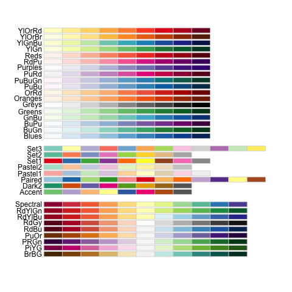

<style type="text/css">
body, td {
font-size: 18px;
text-align: justify;
}
code.r{
    font-size: 16px;
}
pre {
    font-size: 16px
}
h1,h2,h3,h4,h5,h6{
    font-size: 24pt;
}
</style>

# Elementos da Aula

1. [Criação de figuras na `base` do R](#anchor1)  
    1.1. [Histograma](#anchor2)  
    1.2. [Gráfico de barras](#anchor3)  
    1.3. [Boxplot](#anchor4)  
    1.4. [Regressão](#anchor5)   
2. [Customização de figuras](#anchor6)  
    2.1. [Formatos dos pontos](#anchor7)  
    2.2. [Cores e preenchimentos](#anchor8)  
    2.3. [Linhas](#anchor9)  
    2.4. [Texto](#anchor10)  
    2.5. [Eixos](#anchor11)
3. [Outros argumentos gráficos](#anchor22)
4. Exercícios
    + [Exercício 1](#anchor12)
    + [Exercício 2](#anchor13)
    + [Exercício 3](#anchor14)
    + [Exercício 4](#anchor15)
    + [Exercício 5](#anchor16)
    + [Exercício 6](#anchor17)
    + [Exercício 7](#anchor18)
    + [Exercício 8](#anchor19)
    + [Exercício 9](#anchor20)
    + [Exercício 10](#anchor21)

## 1. Criação de figuras na `base` do R {#anchor1}

* O pacote da `base` do R possui uma série de funções orientadas à criação de figuras a partir de um conjunto de dados - normalmente, vetores ou colunas de um `data.frame`.
* Apesar de existirem muitos outros pacotes utilizados atualmente para a criação de figuras (_e.g._, `ggplot2`), é importante que saibamos construir as figuras na `base` do R pois:
    + Muitas vezes não queremos figuras em um padrão de publicação, mas apenas queremos fazer uma exploração visual rápida de um dado ou uma relação;
    + Alguns pacotes de análises de dados têm interação gráfica direta com a `base` do R, mas não com aqueles outros pacotes gráficos; assim, se você não souber usar a `base`, você não conseguirá sair do lugar; e,
    + Muita da lógica e dos argumentos utilizados nas funções da `base` do R encontra similaridades com àquelas dos outros pacotes; entretanto, é mais fácil aprender a falar na `base` do R e passar para os outros pacotes gráficos do que o contrário.  

---

#### Exercício 1 {#anchor12}

a. Carregue o conjunto de dados das `ilhas` e armazene-o em um objeto de mesmo nome.

---

### 1.1. Histograma {#anchor2}

* Um dos primeiros tipos de figura que desejamos fazer para entender a "cara" de um conjunto de dados é um histograma.
    + Um histograma descreve a distribuição de frequência dos diferentes valores que uma variável pode assumir.
* Podemos construir um histograma utilizando a função `hist`.

```{r fig.align='center', fig.height=6, fig.width=6}
hist(x = CO2$uptake)
```

* Toda a função que cria figuras na `base` do R possui um conjunto de argumentos em comum; aqui, vamos focar em 5 deles:
+ `main`: um vetor de caracteres com um elemento, que corresponde ao __título do gráfico__;   
+ `xlab`: um vetor de caracteres com um elemento, que corresponde ao __título do eixo x__;   
+ `ylab`: um vetor de caracteres com um elemento, que corresponde ao __título do eixo y__;  
+ `xlim`: um vetor numérico com dois elementos, que vão definir os __limites mínimos e máximos__ dos valores a serem representados no __eixo x__;  
+ `ylim`: um vetor numérico com dois elementos, que vão definir os limites mínimos e máximos dos valores a serem representados no __eixo y__;
* Podemos utilizar estas funções para tornar a figura mais informativa para nós mesmos:

```{r fig.align='center', fig.height=6, fig.width=6}
hist(x = CO2$uptake, main = "Variação na captura de CO2", xlab = "Captura de CO2", ylab = "Frequência",
     xlim = c(0, 60), ylim = c(0, 18))
```

---

#### Exercício 2 {#anchor13}

a. Crie um histograma que descreva a distribuição dos valores da riqueza de espécies nas ilhas, editando as informações da figura;
b. Agora, crie um histograma que descreva a variação na área das ilhas;
c. Repita o exercício do item anterior, mas agora utilizando o valor do logarítimo da área das ilhas.

---

### 1.2. Gráfico de barras {#anchor3}

* Uma forma de apresentar a variação nos valores das médias ou número de observações entre categorias é através de gráficos de barra.  
* Utilizamos a função `barplot` para construir um gráfico de barras a partir de um `data.frame` que contenham os nomes das categorias e os valores respectivos a serem plotados.  
* A função `table` é muito útil para contar quantos casos existem dentro de cada nível de uma ou mais variáveis categóricas.  

```{r fig.align='center', fig.height=6, fig.width=6}
## variacao no número de observacoes disponiveis para carros com 3, 6 e 8 cilindros
table(mtcars$cyl)
## criando um gráfico de barras para visualizar estes números
barplot(height = table(mtcars$cyl))
```

* Por outro lado, podemos também plotar as médias e erros padrão entre categorias, apesar disso ser bem mais trabalhoso!  
    + Vamos utilizar a função `by` para calcular as médias para dois tratamentos e armazenar os valores em um objeto;   
    + Vamos então coagir este objeto a ser um vetor e sobre-escrevê-lo;  
    + Vamos fornecer os nomes de cada elemento deste vetor;  
    + Vamos repetir o procedimento acima para calcular o erro padrão, armazenando os valores em outro objeto;  
    + Vamos utilizar o `barplot` para criar o gráfico de barras com as médias;  
    + Vamos utilizar a função `segments` para adicionar um segmento que represente o erro padrão de cada nível.  
        + Através desta função, precisamos especificar onde no eixo x a barra de erro estará e até onde nesse mesmo eixo ela vai;  
        + Também precisamos especificar de onde ela partirá no eixo y e até onde ela irá neste mesmo eixo.  

```{r fig.align='center', fig.height=6, fig.width=6}
## calculando as médias
(medias <- by(data = CO2$uptake, INDICES = list(CO2$Treatment), FUN = mean))
## coagindo o objeto a ser um vetor
(medias <- as.vector(medias))
## adicionando nomes a cada elemento desse vetor
names(medias) <- c("nonchilled", "chilled")
## verificando objeto
medias
## repetindo o procedimento acima para os erros
(erro <- by(data = CO2$uptake, INDICES = list(CO2$Treatment), FUN = sd))
(erro <- as.vector(erro))
names(erro) <- c("nonchilled", "chilled")
erro
## calculando erro padrao como: sd/sqrt(n)
## temos table(CO2$Treatment) = 42 observacoes de cada tratamento, logo:
(erro <- erro/sqrt(42))
## plotando os valores das médias
barplot(height = medias, ylim = c(0, 40))
## plotando os valores dos erros padrão, indexando cada barra e cada erro um por vez
segments(x0 = 0.7, x1 = 0.7, y0 = medias[1], y1 = medias[1] + erro[1]) # para o primeiro tratamento
segments(x0 = 1.9, x1 = 1.9, y0 = medias[2], y1 = medias[2] + erro[2]) # para o primeiro tratamento
```

* A `base` do R não é boa em criar gráficos de barra que representam valores de média e dispersão (erro padrão, desvio padrão ou intervalo de confiaça) - para tal, normalmente é necessário linhas e linhas de código para se fazer algo que é simples; nesse sentido, minha recomendação é fazer gráficos deste tipo em específico em outros pacotes gráficos.
* Lembrando também que todos aqueles argumentos que controlam os aspectos visuais do gráfico que vimos para o histograma, valem aqui também!

---

#### Exercício 3 {#anchor14}

a. Crie um gráfico de barras que demonstre a variação na médias da riqueza de espécies entre ilhas pertencentes aos diferentes tipos de arquipélagos, adicionando também a estimativa do erro padrão.

---

### 1.3. Boxplot {#anchor4}

* O boxplot representa a variação na distribuição dos valores observados entre categorias, e é um dos tipos de gráficos mais bem conhecidos e utilizados;  
* Todo boxplot tende a apresentar a mediana da distribuição dos dados, os quartis de 25% e 75% e o intervalo inferior e superior que corresponda a 1.5x a diferença entre aqueles dos quartis (_Interquartile range_);  
* Podemos implementar um boxplot através da função de mesmo nome: `boxplot`.  

```{r fig.align='center', fig.height=6, fig.width=6}
boxplot(x = CO2$uptake)
```

* O boxplot é extremamente poderoso em nos mostrar qual deve ser a distribuição aproximada de um conjunto de dados; compare, por exemplo, o boxplot que nós fizemos com um histograma utilizando o mesmo conjunto de dado:  

```{r echo=FALSE, fig.align='center', fig.height=6, fig.width=6}
par(mfrow = c(2, 1))
boxplot(x = CO2$uptake, xlab = "Captura de CO2", ylim = c(0, 60), horizontal = TRUE)
hist(x = CO2$uptake, main = "", xlab = "Captura de CO2", ylab = "Frequência", xlim = c(0, 60), ylim = c(0, 18))
par(mfrow = c(1, 1))
```

* O emprego mais útil do boxplot é demonstrar as diferenças na distribuição dos dados entre os níveis de um mesmo fator.
* Para poder ter acesso a este tipo de visualização é necessário que passemos a utilizar o argumento da `formula`, comum em várias funções da linguagem de programação R.
    + Toda `formula` toma como padrão a notação `y ~ x`, isto é: `variável resposta ~ variável preditora`;
    + Além disso, a função `boxplot` possui o argumento `data`, que nos permite informar onde estará todos os elementos utilizados dentro da `formula` - eliminando assim a necessidade de indexação dos elementos desejados.  

```{r fig.align='center', fig.height=6, fig.width=6}
boxplot(uptake ~ Treatment, data = CO2)
```

* Mais uma vez, todos argumentos que controlam os aspectos visuais do gráfico que vimos para o histograma e gráfico de barras, valem aqui também!

---

#### Exercício 4 {#anchor15}

a. Crie um `boxplot` que represente a variação na riqueza de espécies entre ilhas costeiras e oceânicas, modificando os aspectos visuais do gráfico.  

---

### 1.4. Regressão {#anchor5}

* Finalmente, um último tipo de figura que normalmente fazemos são gráficos de regressão, que representam a relação entre duas variáveis contínuas.
* Gráficos de regressão são implementados através da função `plot`, e também fazem uso de uma `formula`.

```{r fig.align='center', fig.height=6, fig.width=6}
plot(uptake ~ conc, data = CO2)
```

* E, mais uma vez, todos argumentos que controlam os aspectos visuais do gráfico que vimos para o histograma, gráfico de barras e boxplot, valem aqui também! 

---

#### Exercício 5 {#anchor16}

a. Crie um gráfico de regressão que representa a relação entre a riqueza de espécies e a área das ilhas.
b. Reproduza o gráfico acima, mas assumindo que tanto a riqueza de espécies quanto a área das ilhas estão em escala logarítimica.

---

## 2. Customização de figuras {#anchor6}

* O que vimos até agora foi como construir quatro dos principais tipos de figuras que normalmente utilizamos em trabalhos científicos, e como modificar as informações que descrevem a sua aparência geral.  
* O que veremos agora é como modificar outros aspectos visuais destas figuras, de forma que possamos customizar a sua aparência de acordo com a mensagem que queremos que fique mais clara. Isto normalmente envolve:
    + Modificar as figuras geométricas que representam os pontos em um gráfico de regressão;
    + Adicionar cores ou preenchimentos à figura;
    + Modificar a espessura e tipos de linhas utilizadas;
    + Adicionar e editar o texto existente em uma figura;
    + Adicionar ou modificar informações aos eixos.
    
### 2.1. Formatos dos pontos {#anchor7}  

* Os pontos em um gráfico de regressão são controlados pelo argumento `pch`, que recebe um vetor numérico com um elemento que determina o código do tipo de ponto desejado.  
    + Os valores de 0 a 14 representam figuras geométricas vazadas, onde a única personalização de cores são em suas bordas;  
    + Os valores de 15 a 20 representam figuras geométricas preencidas, onde a única personalização de cores é o seu preenchimento;  
    + Os valores de 21 a 25 são figuras geométricas preenchidas, onde podemos personalizar tanto a cor das bordas quanto a de seu preenchimento.  

<center></img></center>  

```{r fig.align='center', fig.height=6, fig.width=6}
plot(uptake ~ conc, data = CO2, pch = 1)
plot(uptake ~ conc, data = CO2, pch = 16)
plot(uptake ~ conc, data = CO2, pch = 21)
```

* Existe também a possibilidade de usarmos caracteres para determinar o formato dos pontos, embora isto não seja muito usual!

```{r fig.align='center', fig.height=6, fig.width=6}
plot(uptake ~ conc, data = CO2, pch = "@")
```

* Podemos também modificar o tamanho dos pontos, através do argumento `cex`.

```{r fig.align='center', fig.height=6, fig.width=6}
plot(uptake ~ conc, data = CO2, pch = 16, cex = 0.5)
plot(uptake ~ conc, data = CO2, pch = 16, cex = 1)
plot(uptake ~ conc, data = CO2, pch = 16, cex = 2)
```

* Finalmente, como podemos fazer para que cada nível de um fator receba figuras geométricas com características diferentes? A resposta para isso está na construção da figura etapa a etapa e na indexação!
    + Devemos criar um gráfico vazio, utilizandoo argumento `type` dentro da função `plot`, e dizendo que `type = "n"`.
    + Adicionar os pontos que correspondam a uma determina condição através da função `points`;
    + Repetir o processo tantas vezes quantas as necessárias.

```{r fig.align='center', fig.height=6, fig.width=6}
# criando a figura vazia
plot(uptake ~ conc, data = CO2, type = "n")
# adicionando os pontos correspondentes a cada um dos dois tratamentos
points(uptake ~ conc, data = CO2[CO2$Treatment == "nonchilled",], pch = 16)
points(uptake ~ conc, data = CO2[CO2$Treatment == "chilled",], pch = 21)
```

* Note portanto que para personalizar completamente cada um dos níveis de uma variável categórica (_i.e._, um fator) é necessário utilizar a indexação, e veremos que esta mesma ideia pode ser aplicada quando quisermos personalizar outros aspectos visuais da figura (cores, tipos e grossuras de linhas, tamanho de texto e por aí vai). 
* Além disso, este exemplo deixa claro que a personalização de gráficos não é tarefa fácil na `base`, e exige muitas linhas de comando para fazer algo simples. É por esta razão que as pessoas tendem a preferir outros pacotes gráficos, como o `ggplot2`.

---

#### Exercício 6 {#anchor17}

a. Faça um gráfico de regressão entre a riqueza de espécies e a área da ilha (relação log-log), adicionando as informações necessárias para melhor compreensão do que o gráfico está representado, bem como tipos de pontos diferentes para ilhas de cada tipo de arquipélago.  

---

### 2.2. Cores e preenchimentos {#anchor8}  

* Para personalizar as cores das figuras geométricas devemos utilizar dois tipos de argumentos:
    + `col` (de **col**or), para controlar a __cor da borda__ nas figuras com `pch` de __0 a 14 e 21 a 25__;
    + `col` (de **col**or), para controlar a __cor do preenchimento__ nas figuras com  `pch` de __15 a 20__;
    + `bg` (de **b**ack**g**round), para controlar a __cor do preenchimento__ nas figuras com  `pch` de __21 a 25__;

```{r fig.align='center', fig.height=6, fig.width=6}
# modificando a cor da borda
plot(uptake ~ conc, data = CO2, pch = 1, col = "indianred3")
plot(uptake ~ conc, data = CO2, pch = 1, col = "indianred3", bg = "grey70") # nao funciona!
# modificando a cor do preenchimento
plot(uptake ~ conc, data = CO2, pch = 16, col = "indianred3")
plot(uptake ~ conc, data = CO2, pch = 16, col = "indianred3", bg = "grey70") # nao funciona!
# modificando a cor da borda e do preenchimento
plot(uptake ~ conc, data = CO2, pch = 21, col = "indianred3") # muda somente a cor da borda
plot(uptake ~ conc, data = CO2, pch = 21, col = "indianred3", bg = "grey70") # muda a cor da borda e do preenchimento
```

* Existem várias formas de determinar e descobrir quais são as cores disponíveis para usarmos em uma figura:
    + Através do nome dela, seja àquelas que voce já conhece (blue, red, green,...) ou ainda digitando o comando `colors()`. Neste último caso, você pode encontrar um arquivo contendo uma amostra de cada uma dessas cores em: http://www.stat.columbia.edu/~tzheng/files/Rcolor.pdf;
    + Através do código hexadecimal da cor, por exemplo `#FFFFFF` para a cor branca. Você pode encontrar o código hexadecimal de várias cores no próprio Microsoft Office (ou programas similares) e, também, no Adobe Kuler;
    + Através de paletas de cores pré-programadas, que existem dentro de pacotes como o `RColorBrewer` e o `viridis`.  
    
<center></img></center>      

<center></img></center>      

* O argumento `col` também pode ser usado para modificar a cor de linhas e de textos, enquanto que a função `borders` altera a cor da borda de boxplots.

---

#### Exercício 7 {#anchor18}

a. No gráfico criado no exercício 6, modifique as cores dos pontos de forma que as ilhas costeiras e as ilhas oceânicas sejam diferenciadas umas das outras.

---

### 2.3. Linhas {#anchor9}  

* Existem duas formas de adicionarmos e/ou modificarmos linhas em um gráfico na `base`.
* A primeira delas é através de argumento específicos utilizados nas funções que criam estes gráficos, tais como `lwd` (**l**ine **w**i**d**th; grossura da linha) e `lty` (**l**ine **ty**pe; tipo de linha).

<center></img></center>      
  
  
```{r fig.align='center', fig.height=6, fig.width=6}
boxplot(uptake ~ Treatment, data = CO2, col = c("red", "blue"), 
        lwd = c(0.5, 2), lty = c(1, 2))
```

* A outra forma, é através da função `lines` ou `segments` quando queremos desenhar uma linha ligando dois ou mais pontos ou, ainda mais normalmente, a função `abline`, que usamos para plotar as predições de um modelo linear.

```{r fig.align='center', fig.height=6, fig.width=6}
## criando um modelo para descrever a relação entre a captura e a concentração de CO2
modelo <- lm(uptake ~ conc, data = CO2)
## plotando a figura principal
plot(uptake ~ conc, data = CO2, pch = 21, bg = "indianred3")
## adicionando a linha de tendencia
abline(reg = modelo, lwd = 3, lty = 1, col = "dodgerblue3") # direto através do modelo
abline(a = 0, b = 0.05, lwd = 3, lty = 2, col = "forestgreen") # uma linha de referencia com intercepto a = 0 e slope b = 0.05
abline(v = 600, lwd = 3, lty = 3, col = "gold3") # uma linha de referencia no eixo x
abline(h = 30, lwd = 3, lty = 4, col = "firebrick2") # uma linha de referencia no eixo y
```

---

#### Exercício 8 {#anchor19}

a. Adicione uma linha de tendência no gráfico que você gerou no exercício 7, de acordo com o modelo que representa a relação visualizada.

---

### 2.4. Texto {#anchor10}  

* Podemos também adicionar um texto diretamente à figura que estamos criando ou, ainda, editar o texto já existente eu seu título, no título dos eixos ou no texto do eixo.
* A função `cex.main`, `cex.lab` e `cex.axis` modificam o tamanho do texto no título do gráfico, dos eixos e na legendas dos eixos, respectivamente.

```{r fig.align='center', fig.height=6, fig.width=6}
plot(uptake ~ conc, data = CO2, pch = 21, bg = "indianred3", 
     main = "Captura ~ Concentração", ylab = "Captura de CO2", xlab = "Concentração de CO2",
     cex.main = 2, cex.lab = 1.5, cex.axis = 1)
```

* Podemos modificar as cores do texto diretamente nas funções que criam as figuras utilizando os argumentos `col.main`, `col.lab` e `col.axis`, para o título do gráfico, dos eixos e da legenda dos eixos, respectivamente.

```{r fig.align='center', fig.height=6, fig.width=6}
plot(uptake ~ conc, data = CO2, pch = 21, bg = "indianred3", 
     main = "Captura ~ Concentração", ylab = "Captura de CO2", xlab = "Concentração de CO2",
     cex.main = 2, cex.lab = 1.5, cex.axis = 1, 
     col.main = "blue", col.lab = "gold3", col.axis = "forestgreen")
```

* Finalmente, podemos modificar a família da fonte utilizada na figura toda utilizada o argumento `family` ou, ainda, se queremos a fonte em negrito, itálico ou outras formas através dos argumentos `font` (aplicada à toda a figura), ou `font.main`, `font.lab` e `font.axis` (aplicados individualmente ao título do gráfico, dos eixos e da legenda dos eixos, respectivamente).

```{r fig.align='center', fig.height=6, fig.width=6}
plot(uptake ~ conc, data = CO2, pch = 21, bg = "indianred3", 
     main = "Captura ~ Concentração", ylab = "Captura de CO2", xlab = "Concentração de CO2",
     cex.main = 2, cex.lab = 1.5, cex.axis = 1, 
     col.main = "blue", col.lab = "gold3", col.axis = "forestgreen",
     font.main = 3, font.lab = 2, font.axis = 1,
     family = "Times")
```

* Todas essas customizações estão sendo feitas diretamente ao texto existente na figura. Por outro lado, podemos adicionar um novo texto em algum ponto dentro da área de plotagem e utilizar argumentos similares para controlar a aparência do texto. Fazemos isso através da função `text`.
    + Podemos associar a função `text` à `paste` e esta últimas, por vezes, à função `round`.  

```{r fig.align='center', fig.height=6, fig.width=6}
## vamos adicionar a fórmula do modelo à figura
modelo
## criando a figura
plot(uptake ~ conc, data = CO2, pch = 21, bg = "indianred3", 
     main = "Captura ~ Concentração", ylab = "Captura de CO2", xlab = "Concentração de CO2")
text(x = 600, y = 9, labels = "y = 19.50029 + 0.01773x", cex = 1.2, font = 2, col = "dodgerblue3")

## automatizando a extração dos valores da formula do modelo para adicionar à figura
paste("y =", coef(modelo)[1], "+", coef(modelo)[2], "x")
## plotando formula automaticamente
plot(uptake ~ conc, data = CO2, pch = 21, bg = "indianred3", 
     main = "Captura ~ Concentração", ylab = "Captura de CO2", xlab = "Concentração de CO2")
text(x = 600, y = 9, labels = paste("y =", coef(modelo)[1], "+", coef(modelo)[2], "x"), 
     cex = 1, font = 2, col = "dodgerblue3")
```

---

#### Exercício 9 {#anchor20}

a. Adicione a fórmula referente ao modelo que a figura representa em sua área de plotagem.  

---

### 2.5. Eixos {#anchor11}

* Por fim, é possível que também tenhamos que editar o conteúdo dos eixos de uma figura, de forma modificar os valores que aparecerão na legendas dos eixos, a sua posição, além do tamanho e posição dos tracinhos, e a espessura, cor e tipo de linha que formam os eixos.
* Todas estas customizações podem ser conseguidas através da função `axis`. Todavia, só conseguiremos manipular estes eixos dessa forma caso os próprios eixos da figura sejam suprimidos quando de sua criação

```{r fig.align='center', fig.height=6, fig.width=6}
# criando a figura, sem os eixos
plot(uptake ~ conc, data = CO2, pch = 21, bg = "indianred3", axes = FALSE,
     main = "Captura ~ Concentração", ylab = "Captura de CO2", xlab = "Concentração de CO2")
# adicionando os valores do eixo de baixo, manipulando o número de ticks e a sua orientacao
axis(side = 1, at = seq(from = 0, to = 1100, by = 100), tcl = 0.5)
# adicionando os valores do eixo da esquerda, manipulando os valores que aparecerão
axis(side = 2, at = seq(from = 0, to = 45, by = 5), 
     labels = c(0, "", 10, "", 20, "", 30, "", 40, ""))
```

---

#### Exercício 10 {#anchor21}

a. Edite os eixos da figura que você tem trabalhado até este ponto da aula.

---

### 2.6. Outros argumentos gráficos {#anchor22}

* Existem muitas outras funcionalidades que podemos implementar na `base` do R para que possamos construir figuras, o que se reflete na enorme quantidade de livros e materiais existentes sobre o tópico! Portanto, não é minha intenção cobrir todos aqui, mas os elementos básicos apresentados já fornecem a indicação de um caminho por onde seguir.
* A principal forma de manipular outros aspectos gráficos mais detalhados da `base` do R está na função `par()`, que controla todos os parâmetros estéticos das figuras geradas.
* Apesar de não termos coberto detalhadamente algumas outras funções e utilidades, abaixo apresento algumas funções que podem vir à mão no seu dia-a-dia.
    + `locator`: utilizado para extrair informações das coordenadas de dois pontos em um gráfico através de clicks;
    + `par(mfrow = c(1, 1))`: cria figuras multipainéis ao modificar a forma como elas são preenchidas entre linhas e colunas;
    + `par(mfcol = c(1, 1))`: cria figuras multipainéis ao modificar a forma como elas são preenchidas entre linhas e colunas;
    + `par(mar = c(5.1, 4.1, 4.1, 2.1))`: define as margens do painel de plotagem em cada um dos quatro lados (embaixo, esquerda, topo, direita);
    + `legend`: para adicionar uma legenda em algum ponto da figura;
    + `rect`: para desenhar um retângulo em uma figura;
    + `polygon`: para desenhar um polígono qualquer em uma figura.
