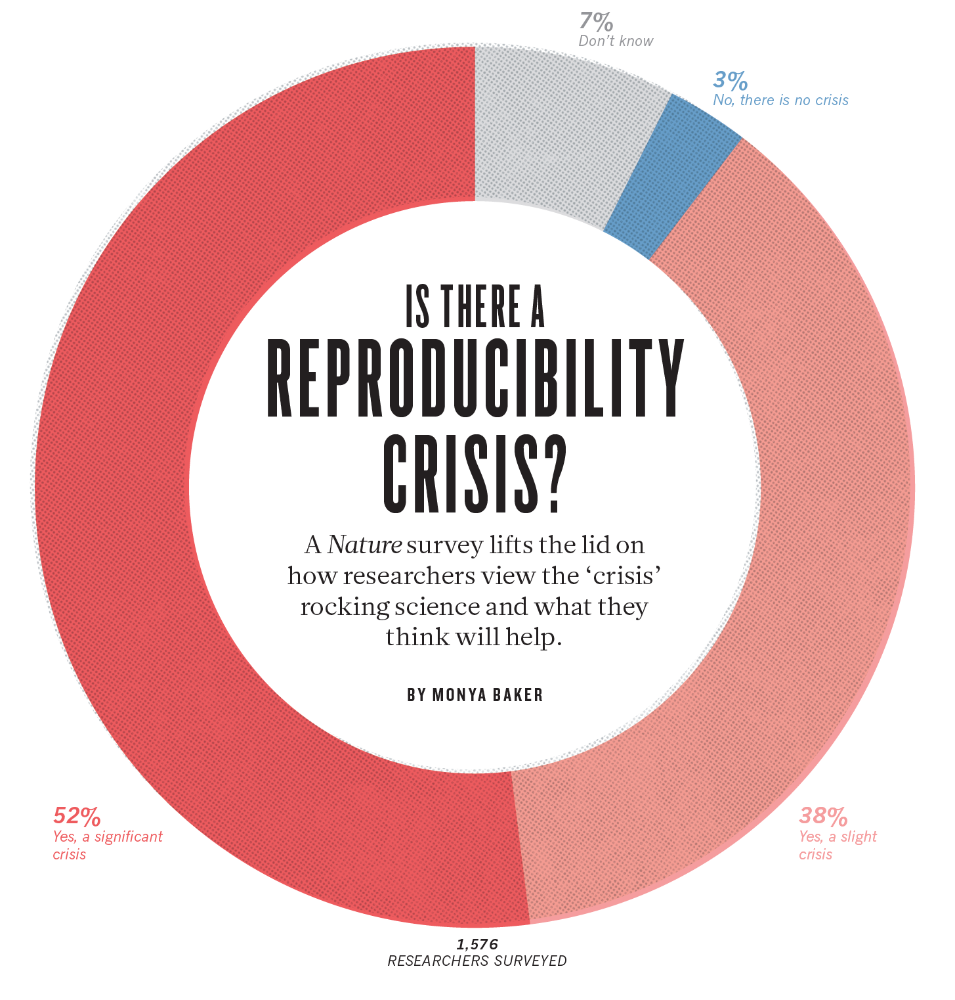
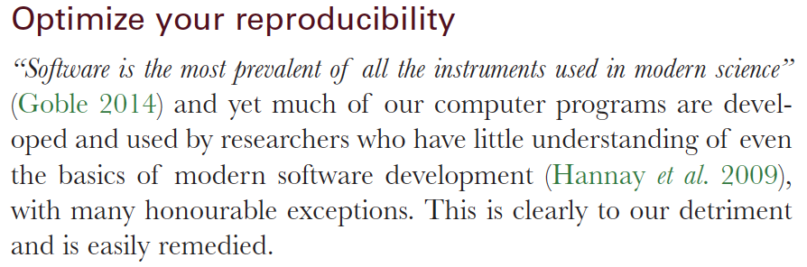
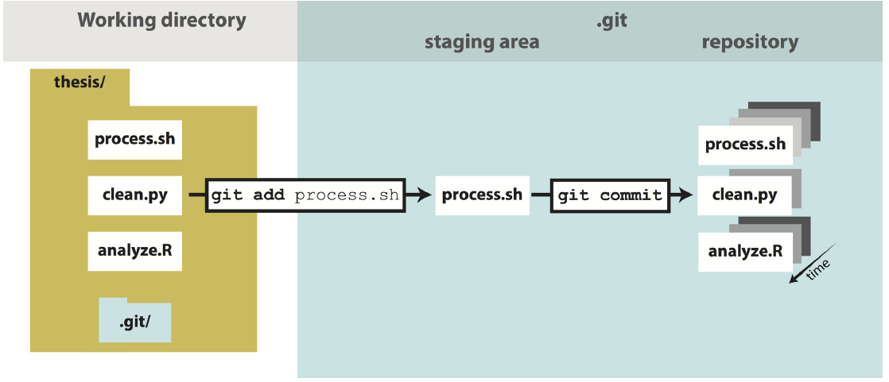
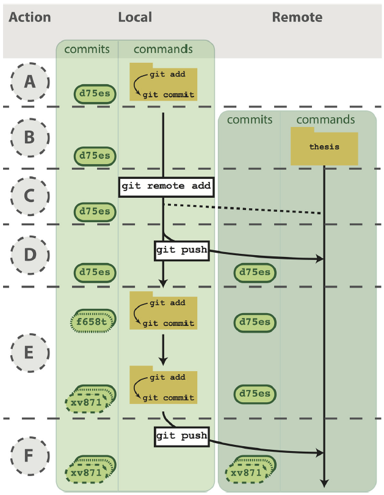

# Elementos da Aula

1. Reproducible Research;  
2. Controle de Versão;  
3. Introdução ao GitHub;  
4. `rmarkdown`.  

---

## Reproducible Research

> __O que é *reproducible* research?__

Para alguns, é um termo que representa o fato de todo o achado a partir de um código e um dado poder ser reproduzido de forma identica caso este código e dado esteja disponível. Para outros, a definição é mais ampla, e envolve a noção de que que qualquer cientista usando os mesmos métodos pode chegar a resultados similares e fazer as mesmas inferências sobre um resultado já publicado - __é o coração da ciência__.

---

* Quais os elementos de um trabalho reprodutível (baseado em Ihle et al, 2017, Behav Ecol)?  
1. __Reliability (Confiabilidade):__ o pesquisador testou uma hipótese de forma objetiva (é o padrão de ouro);  
    + _Falta de Confiabilidade_: falha em conduzir a pesquisa de acordo com o plano documentado.  
  
2. __Reproducibility (Reprodutibilidade):__ dada a mesma questão, dados brutos e métodos, alguém com mesmo conhecimento deve chegar na conclusão;  
    + _Falta de Reprodutibilidade_: falha em garantir que reconduzir o mesmo projeto vai resultar no mesmo achado.   
  
3. __Replicability (Replicabilidade):__ validação de um experimento e/ou achado através de repetições em estudos independentes.    
    + _Falta de Replicabilidade_: baixa probabilidade de que estudos independentes chegarem ao mesmo resultado.  
    
---

Apesar de parecer fantástico, a ideia de que estamos em uma crise de reprodutibilidade não é algo tão distante assim...

</img>
  
_Fonte: Baker & Penny, 2016, Nature, Is there a reproducibility crisis?_

---

Como identificar se o seu trabalho está sendo afetado pela crise de reprodutibilidade (baseado em Ihle et al, 2017, Behav Ecol)?   
  
1. __Confiabilidade - você já...__  
    a. tornou o nome das suas amostras não identificável de forma que você não saiba o que esperar delas?  
    b. pediu para uma pessoa que não sabe nada sobre a sua hipótese coletar os dados (ou te ajudar)?  
    c. continuou amostrando sabendo que existia um resultado nulo, de forma a aumentar o seu poder estatístico, e não reportou esta decisão a posteriori?  
    d. reformulou uma hipótese baseado no que você encontrou, e apresentou o achado não esperado 'fingindo' que você já predizia ele desde o começo (_HARKing - Hypothesis After Results Are Known_)?
    e. reportou somente as medidas de interesse e deixou de fora outros que você testou?  
    f. excluiu outliers baseado na significância dos seus resultados antes e depois da exclusão?  
    g. excluiu, incluiu e transformou covariáveis para achar o melhor modelo, mas só reportou o modelo final?  
    
2. __Reprodutibilidade - você já...__  
    h. passou um tempão reprocessando e reanalisando os dados sem ser capaz de demonstrar para você ou outrém se todos os passos do processamento e análise foram identicos ao da vez anterior?  
    i. achou um erro nos seus resultados sem saber de onde ele veio?  
    j. perdeu parte dos dados ou notas sobre como processar os dados e obter outras variáveis de interesse?  
    k. esqueceu qual análise você já havia feito?
    l. teve dificuldade de responder estas questões para um revisor, amigo e/ou colaborador?
  
3. __Replicabilidade - você já...__  
    m. baseou todo um projeto em um achado sem poder saber se ele é válido na realidade?  
    n. foi incapaz de replicar um estudo publicado anteriormente (inclusive, conceitualmente)?  
    o. não conseguiu provar que um trabalho este sujeito ao viés de confirmação?  

---

> __Pseudoscience (Richard P. Feynman):__ ciência que não é ciência...segue os métodos, segue a forma, mas não chega a lugar algum, não gera leis e nem predições (e.g., a metáfora das pistas de avião; controvérsias alimentares; controvérsias sobre comportamento; controvérsias sobre o funcionamento das coisas).   

E tem jeito?

</img>
  
_Fonte: Barba, 2016, Science, The hard road to reproducibility?_

</img>
  
_Fonte: Ihle et al, 2017, Behav Ecol, Striving for transparent and credible research - practical guidelines for behavioral ecologists_

Reprodutibilidade é um hábito que pode ser adquirido e, uma vez que você começa a praticar, não tem mais como parar.  

> Ninguém nasce sabendo a importância dessas coisas, e tão pouco começa a carreira acadêmica sendo treinado em uma carreira de reprodutibilidade. É preciso que nós falemos mais sobre isso, com nossos colaboradores, amigos, amigos de laboratório, orientadores,...é só através do treinamento e da capacitação das pessoas é que nós vamos conseguir fazer melhor.  

* Pequenos hábitos que fazem a diferença:
    + antes de iniciar o seu projeto de pesquisa, descreva as suas hipóteses e/ou objetivos, crie ilustrações mostrando qual é o resultado esperado que você está buscado;  
    + anote TUDO o que você fizer e ver de forma padronizada: confeccione cadernos de campo padrão, crie um livro de protocolos,...   
    + tabele os seus dados com atenção, cheque de forma dupla se você não está esquecendo de tabelar alguma informação e/ou procure saber com os seus colaboradores e origem da ausência de dados;  
    + documente todas as etapas da análise de dados - decisões, escolhas, lógica e caminhos;    
    + use um script para limpar seus dados e realizar todo e qualquer tipo de manipulação;  
    + use caminhos relativos;  
    + use uma ferramenta de controle de versão;  
    + ...

---

## Controle de Versão

> A reposta curta: é um programa que acompanha as mudanças feitas em arquivos específicos ao longo do tempo, e mantém um registor de todas as versões anteriores daqueles arquivos.

Quando estamos tabelando um dado, escrevendo um código, gerando os resultados de uma análise ou escrevendo um documento, muitas vezes vamos nos deparar com alguns causos:  
  
1. manter um arquivo de cópia de cada passo que tomamos ao escrever ou editar algo, só para garantir que temos aquele arquivo original salvo;  
2. ideias relâmpago e dias _intensos_, em que você vai ficar indo e vindo o tempo todo no que você está trabalhando, mas no final do dia vai querer algo similar ao que você gerou lá no início;  
3. ao compartilhar um código, dado ou outro arquivo com alguém, as pessoas podem fazer edições e não te indicar exatamente o que mudaram OU indicar e você ter que fazer a conferência entre versões manualmente.  

---

Uma forma de lidar com estes (e outros) causos de forma mais fácil é através do uso de um __sistema de controle versão__ (para mais informações, ver: Blischak et al, 2016, PLOS Comp Biol, A quick introduction to version control with Git and GitHub).

> Um sistema de controle de versão permite que você mantenha um registro de cada mudança que você fez em um código, dado ou arquivo (desde que ele seja 'lido' linha-a-linha). Com isto, você tem a opção de reverter uma mudança que você fez a partir de alguma versão do seu trabalho, além de escrever mensagens para si próprio cada vez que você faz uma destas alterações e faz o controle da versão. Assim, qualquer pessoa que olhe o histórico de desenvolvimento da tarefa consegue entender a lógica que você usou em cada passo do processo criativo. Além disso, um sistema de controle de versão facilita o trabalho colaborativo, uma vez que também permite que seus colaboradores possam incorporar suas próprias contribuições à tarefa diretamente em seu código/dado/arquivo em formato original - e se você não gostar, sabe exatamente onde e quem fez a edição, e pode reverter ela.

Então, com um sistema de controle de versão:  
  
a. você mantém registro de todas as etapas do processo;  
b. pode retornar a qualquer ponto do histórico de um arquivo;  
c. pode deixar mensagens para você mesmo e outros que indicam a lógico do processo criativo;  
d. colaborações são adicionadas diretamente à tarefa.  

---

Existem vários sistemas de controle de versão, sendo um dos mais conhecidos o __Git__:  
  
* Instalação: https://git-scm.com  
* Video de tutorial de Instalação (Windows): https://www.youtube.com/watch?v=uBH9yspZpK0  
* Video de tutorial de Instalação (Mac): https://www.youtube.com/watch?v=LK0vMt_lEbQ  
* Video de mais um tutorial de instalação: https://www.youtube.com/watch?v=J_Clau1bYco  
* Uma lição do Software Carpentru sobre Git: https://swcarpentry.github.io/git-novice/  
* Fazendo o Git e o RStudio conversarem: https://support.rstudio.com/hc/en-us/articles/200532077-Version-Control-with-Git-and-SVN

--- 

__Como funciona este sistema de controle de versão?__

Após a instalação e configuração do sistema de controle de versão, podemos prosseguir para entender as etapas do processo, que estão sumarizadas abaixo.  

Você começa usando o sistema de controle de versão iniciando um __repositório__ (`git init`) - local onde ficam todos os arquivos que estão sendo acompanhados e têm seu histórico de mudanças armazenado.

Ao criarmos um repositório vazio, precisamos adicionar os arquivos que estarão sob o processo de controle de versão (`git add`). Uma vez que tenhamos adicionado estes arquivos ao processo de controle de versão, dizemos que o arquivo foi movido __staged__ - isto é, movemos o arquivo para  a __staging area__, local em que os arquivos são colocados para serem "fotografados" pelo sistema de controle de versão. Após este último passo, nós temos que "fotografar" o(s) arquivo(s) através do processo de __commit__ (`git commit`) - é a partir desse ponto que a "fotografia" do(s) arquivo(s) é registrada. 

Logo, cada vez que você faz uma alteração em um arquivo, você adiciona este arquivo à area de "fotografia" (__stage__) e "fotografa" a versão do arquivo (__commit__). Além disso, cada versão que você "fotografa" (__commit__) um arquivo, você pode usar uma pequena mensagem descrevendo o que aquela "fotografia" representa. Note também que cada vez que cada "fotografia" dos arquivos que foram para o __commit__ recebem um "número de identidade", que pode ser usado para explorar o histórico e reverter mudanças feitas para cada um daquele momentos.

Assim, toda vez que você fizer uma alteração e salvar um arquivo, o controle de versão vai te indicar que existe uma alteração naquele documento. Você pode __stage__ o documento, então "fotografar" (__commit__) ele e continuar trabalhando, repetindo indefinidamente o processo. Note, no entanto, que aqui só estamos realizando e salvando o processo de controle de versão no nosso próprio computador.  

</img>
  

</img>
  
_Fonte: Blischak et al, 2016, PLOS Computational Biology, A quick introduction to version control with Git and GitHub_
  
* Para observarmos e praticarmos este processo, de forma virtual, podemos usar este tutorial: https://try.github.io/levels/1/challenges/1  

## Introdução ao GitHub

1. O que é?  
2. Quais as vantagens?  
3. Etapas para além do controle de versão padrão;  
4. Por onde fazer tudo?  
5. Links para a instalação.  

</img>
  
_Fonte: Blischak et al, 2016, PLOS Computational Biology, A quick introduction to version control with Git and GitHub_

</img>
  
_Fonte: Blischak et al, 2016, PLOS Computational Biology, A quick introduction to version control with Git and GitHub_

## `rmarkdown`

1. O que é?  
2. Qual a filosofia?  
3. O que você pode criar?  
4. Como usar o rmarkdown?  