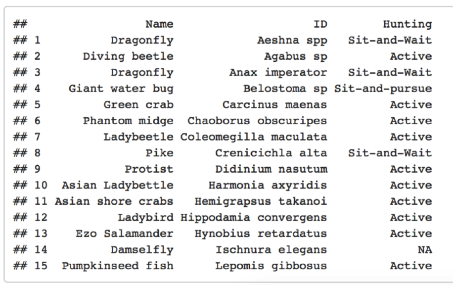

## Métodos tradicionais para leitura de dados {.smaller}

* Os métodos disponíveis no pacote base são:  
    + `read.csv` para arquivos com células separadas por _vírgulas_, como um _.csv_  
    + `read.table` para arquivos com células separadas por _tabulação_, como um _.txt_  


## Argumentos da função read.table() {.smaller}

```{r}
args(read.table)
```


## Métodos tradicionais para leitura de dados {.smaller}

* Os métodos tradicionais exigem alguns cuidados especiais para que os dados possam ser carregados adequadamente. 
* _Maior parte dos erros de leitura de dados ocorrem por conta de erros na edição da planilha_.  
    + "," no lugar de ".";  
    + espaços entre palavras;  
    + espaços no final de um célula;  
    + células vazias;  
    + acento e outras coisas do português;  
    + caracteres especiais.  


## Métodos tradicionais para leitura de dados  

* Um exemplo.  

</img>


## Métodos tradicionais para leitura de dados  {.smaller}

* Todo objeto criado ocupa um espaço, diretamente proporcional ao número de elementos no mesmo.   

```{r}
# vamos simular um conjunto de dados
set.seed(3)
a <- rnorm(n = 10, mean = 0, sd = 1)
a

set.seed(9)
b <- rpois(n = 10, lambda = 6)
b 

set.seed(98)  
c <- rbinom(n = 10, size = 1, prob = 0.5)
c
```

```{r}
# vamos armazenar este conjunto de dados em um data.frame
dados_pequeno <- data.frame(a,b,c)
dados_pequeno
```


## Métodos tradicionais para leitura de dados  

```{r}
format(object.size(dados_pequeno), units = "Mb")
head(dados_pequeno)
```


## Métodos tradicionais para leitura de dados  {.smaller}

```{r}
# agora, vamos simular um conjunto de dados maior ainda

set.seed(3)
x <- rnorm(n = 1e6, mean = 0, sd = 1)

set.seed(9)
y <- rpois(n = 1e6, lambda = 6)

set.seed(98)
z <- rbinom(n = 1e6, size = 1, prob = 0.5)

dados_grande <- data.frame(x,y,z)
dados_grande
```

```{r}
format(object.size(dados_grande), units = "Mb")
```


## Métodos tradicionais para leitura de dados {.smaller}

* Quanto maior o objeto, mais lenta é a sua exportação, importação, leitura e processamento  

```{r}
system.time(write.table(dados_pequeno, "dados/dados_pequeno.txt", 
                        sep = "\t", row.names = FALSE))
```

```{r}
system.time(write.table(dados_grande, "dados/dados_grande.txt", 
                        sep = "\t", row.names = FALSE))
```


## Métodos tradicionais para leitura de dados {.smaller}

* Quanto maior o objeto, mais lenta é a sua exportação, importação, leitura e processamento  

```{r}
system.time(read.table("dados/dados_pequeno.txt", header = TRUE))
```

```{r}
system.time(read.table("dados/dados_grande.txt", header = TRUE))
```


## Alternativas para leitura de dados {.smaller}

* Existem métodos alternativos para a leitura de dados que:  
    + permitem a leitura de outras extensões;  
    + são capazes de ler dados sem a necessidade de edições prévias;
    + são bem mais rápidos na importação e processamento de planilhas.
    


## O pacote readxl {.smaller}

* Criado por Hadley Wickham (cientista chefe do RStudio);  
* Possui apenas duas funções:
    + `read_excel`, para ler uma aba de um arquivo com extensão *".xlsx"* apenas;
    + `excel_sheets`, para ver uma lista com o nome e posição de todas as abas no arquivo.

```{r eval=FALSE}
install.packages("readxl")
```

```{r}
library(readxl)
args(read_excel)
```

## O pacote readr {.smaller}

* Também criado por Hadley Wickham;  
* Pode ler um planilhas de dados com praticamente qualquer tipo de extensão:
    + `read_tsv`, para ler um arquivo com extensão *".xls"* e outros;  
    + `read_csv`, `read_table`, `read_delim`;  
    + `write_tsv` para gravar um arquivo separado por tabulações (*.txt*, *.xls*).  
    
```{r eval=FALSE}
install.packages("readr")
```

```{r message=FALSE, warning=FALSE}
library(readr)
args(read_tsv)
```


## Uma peculiaridade dos pacotes readxl e readr {.smaller}

* São capazes de ler uma planilha de dados exatamente do jeito que ela é.  

</img>


## O pacote data.table {.smaller}

* Não foi criado por Hadley Wickham!;    
* Importa dados de forma rápida;  
* Também fornece algumas ferramentas para manipulação mais rápida de dados.

```{r eval=FALSE}
install.packages("data.table")
```

```{r message=FALSE, warning=FALSE}
library(data.table)
args(fread)
```


## Comparando pacotes {.smaller}

Método tradicional de **salvar dados** pode ser mais rápido do que através de métodos implementados por outros pacotes.

```{r echo = FALSE}
data.frame("write.table" = summary(system.time(write.table(dados_grande, "dados/dados_grande.txt", sep = "\t", row.names = FALSE))),
"write_tsv" = summary(system.time(write_tsv(dados_grande, "dados/dados_grande.txt", col_names = TRUE))))
```


## Comparando pacotes {.smaller}

Métodos de **leitura de dados** implementado por outros pacotes são mais rápidos do que o método tradicional. 

```{r echo = FALSE, message=FALSE, warning=FALSE,error=FALSE}
data.frame("read.table" = summary(system.time(read.table("dados/dados_grande.txt", header = TRUE))),
"read_excel" = summary(system.time(read_excel("dados/dados_grande.xlsx", col_names = TRUE))),
"read_tsv" = summary(system.time(read_tsv("dados/dados_grande.txt", col_names = TRUE))),
"fread" = summary(system.time(fread("dados/dados_grande.txt"))))
```