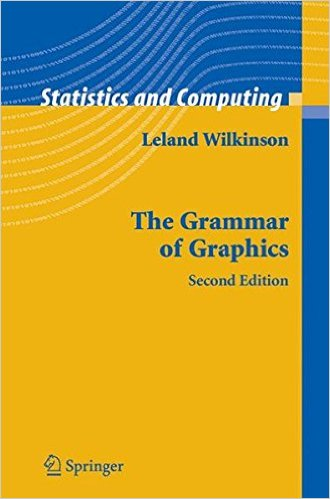

```{r echo=FALSE}
knitr::opts_chunk$set(fig.align="center", fig.height = 4, fig.width = 5)
```

## ggplot2  {.smaller}

* Escrito por Hadley Wickham, quando ainda era um estudante de pós graduação;  
* É um dos pacotes gráficos mais utilizados na linguagem R, junto do pacote `base` e `lattice`;  
* É a implementação do _The Grammar of Graphics_, idéia desenvolvida por Leland Wilkinson.  

<center>
</img>
</center>  

## ggplot2 {.smaller}  

### “Resumidamente, a gramática nos diz que um gráfico deve ser mapeado (__mapping__) a partir dos dados (__data__), de acordo com a aparência (__aesthetic__) (color, formato, tamanho) de objetos geométricos (__geometric__) (pontos, linhas, barras). A figura também pode conter transformações estatísticas dos dados, sendo desenhada a partir de um sistema específico de coordenadas.”  

Do livro "_ggplot2_"  

## ggplot2 {.smaller}  

* Faça um paralelo com a nossa gramática:
    + sujeito (_data_, _aesthetics_)
    + verbo (_geometries_, _facets_)
    + adjetivo (_color_, _fill_, _shape_, _alpha_)
* Diminui a distância da mente para a página.  

<center>
</img>
</center>

## Filosofia do ggplot2 {.smaller}  

* Você desenha, adicionando e modificando as camadas durante o processo.  
    + Não é preciso realizar todo o desenho em um único objeto (ao contrário do `lattice`);  
    + Uma vez que você tenha adicionado uma entidade ao gráfico, você pode alterar ela posteriormente (ao contrário do `base`);  
    + Gráficos complexos, com comandos simples (ao contrário do `lattice` e `base`).  

## ggplot2 {.smaller}  

```{r eval=FALSE}
# para instalação do pacote
install.packages("ggplot2")
```

```{r warning=FALSE, message=FALSE}
# para carregar o pacote
library(ggplot2)
```

## ggplot2 {.smaller}  

Exemplo: os conjunto de dados `CO2` do pacote `datasets` (`?CO2`).  

```{r}
library(datasets);data("CO2")
```

```{r}
str(CO2)
```

## _qplot_ {.smaller}  

* É similar à função `plot` do pacote `base`, mas possui os elementos do _The Grammar of Graphics_.  
```{r}
# "..." são os aesthetics (size, shape, color, fill)
args(qplot)
```

## _qplot_ {.smaller}  

* Exercício 1: por que não precisamos especificar o __geom__?
```{r}
qplot(x = conc, y = uptake, data = CO2, geom = "points")
```

## _qplot_ {.smaller}  

* Podemos adicionar elementos gráficos, baseado em alguma informação sobre os dados.  
```{r fig.height=3, fig.width=4}
qplot(x = conc, y = uptake, data = CO2, shape = Type, 
      size = 3, colour = Treatment)
```

## _qplot_ {.smaller}  

* Podemos criar painéis diferentes com o argumento `facets`.  
```{r fig.height=3, fig.width=4}
qplot(x = conc, y = uptake, data = CO2, facets = ~Type, 
      size = 3, colour = Treatment, shape = Type)
```

## _qplot_ {.smaller}  

* Também podemos alterar o título dos eixos.  
```{r fig.height=3, fig.width=4}
qplot(x = conc, y = uptake, data = CO2, facets = ~Type, 
      size = 3, colour = Treatment, 
      xlab = expression(paste("Concentração de CO "[2])),
      ylab = expression(paste("Captura de CO "[2])))
```

## _qplot_ {.smaller}  

* Especificando outros tipos de `geom`, gráficos diferentes podem ser feitos.  
```{r fig.height=3, fig.width=4}
qplot(x = Treatment, y = uptake, data = CO2, facets = ~Type, 
      geom = "boxplot", fill = Treatment)
```

## _qplot_ {.smaller}  

* Vamos simular alguns dados e fazer um histograma com o `qplot`.  
```{r fig.height=3, fig.width=4}
set.seed(59)
normal <- rnorm(n = 1000, mean = 0, sd = 1) 
qplot(x = normal, geom = "density", fill = 1, 
      xlab = "Distribuição Normal Padrão",
      ylab = "Função de Densidade")
```

## Um resumo sobre _qplot_ {.smaller}

* Funciona de forma similar à função `plot`;  
* Customização do gráfico é limitada;  
* Intenção é produzir gráficos rápidos, para exploração dos dados.  

## _ggplot_ {.smaller}

* É a função chave do `ggplot2`;  
* Permite customização total do gráfico.  

```{r echo=FALSE}
ggplot(CO2, aes(x = conc, y = uptake)) +
  facet_grid(Treatment ~ Type, scales = "free_y") +
  geom_point(aes(colour = Treatment, shape = Type), size = 3, show.legend = FALSE) +
  scale_colour_manual(values = c("red", "blue")) + 
  geom_smooth(linetype = 2, fill = "black", alpha = 0.1, colour = "black") +
  xlab(expression(paste("Concentração de CO "[2]))) +
  ylab(expression(paste("Captura de CO "[2]))) +
  theme(panel.grid = element_blank(),
        panel.background = element_rect(fill = NA, colour = "black"),
        strip.background = element_rect(fill = NA, colour = "black"),
        axis.text = element_text(colour = "black", size = 10),
        axis.title = element_text(colour = "black", size = 12, face = "bold"),
        strip.text = element_text(colour = "black", size = 10, face = "bold"),
        axis.text.x = element_text(margin = margin(1,1,5,1)),
        axis.text.y = element_text(margin = margin(1,1,1,5)))
```

## ggplot {.smaller}  

* Aqui, a filosofia do _The Grammar of Graphics_ é explicitamente colocada em prática.  
* Vamos começar desenhando a base do gráfico: `data` e `aesthetics`.  
```{r fig.height=3, fig.width=4}
g <- ggplot(data = CO2, mapping = aes(x = conc, y = uptake))
g
```

## ggplot {.smaller}  

* Vamos separar os gráficos de acordo com algumas categorias: `facets`.  
```{r fig.height=3, fig.width=4}
g <- g + facet_grid(Treatment ~ Type, scales = "free_y")
g
```

## ggplot {.smaller}  

* Vamos desenhar o que queremos no gráfico: `geom`. 
* Vamos adicionar também como queremos o `geom`: `colour`, `shape`, `alpha`...
```{r fig.height=3, fig.width=4}
g <- g + geom_point(aes(colour = Treatment, shape = Type), size = 3, show.legend = FALSE)
g
```

## ggplot {.smaller}  

* Podemos editar as cores dos pontos manualmente.  
```{r fig.height=3, fig.width=4}
g <- g + scale_colour_manual(values = c("red", "blue"))
g
```

## ggplot {.smaller}  

* Editar o título dos eixos.  
```{r fig.height=3, fig.width=4}
g <- g + xlab(expression(paste("Concentração de CO "[2]))) +
  ylab(expression(paste("Captura de CO "[2])))
g
```

## ggplot {.smaller}  

* E adicionar uma linha de tendência.  
```{r fig.height=3, fig.width=4}
g <- g + geom_smooth(linetype = 2, fill = "black", alpha = 0.1, colour = "black")
g
```

## ggplot {.smaller}  

Você possui duas formas de customizar a aparência do gráfico:  
    + Temas pré-determinados: `theme_bw`, `theme_classic`, `theme_dark`, `theme_light`  
    
```{r fig.height=3, fig.width=4}
g + theme_bw()
```

## ggplot {.smaller}  

Você possui duas formas de customizar a aparência do gráfico:  
    + Temas pré-determinados: `theme_bw`, `theme_classic`, `theme_dark`, `theme_light`  
    + Temas pessoal: `theme`
    
```{r eval=FALSE}
?theme
```

## ggplot {.smaller}  

* Você pode adicionar o tema criado diretamente ao gráfico.  
```{r eval=FALSE}
g + theme(panel.grid = element_blank(),
        panel.background = element_rect(fill = NA, colour = "black"),
        strip.background = element_rect(fill = NA, colour = "black"),
        axis.text = element_text(colour = "black", size = 10),
        axis.title = element_text(colour = "black", size = 12, face = "bold"),
        strip.text = element_text(colour = "black", size = 10, face = "bold"),
        axis.text.x = element_text(margin = margin(1,1,5,1)),
        axis.text.y = element_text(margin = margin(1,1,1,5)))
```

## ggplot {.smaller}  

* Você pode adicionar o tema criado diretamente ao gráfico.  
```{r echo=FALSE}
g + theme(panel.grid = element_blank(),
        panel.background = element_rect(fill = NA, colour = "black"),
        strip.background = element_rect(fill = NA, colour = "black"),
        axis.text = element_text(colour = "black", size = 10),
        axis.title = element_text(colour = "black", size = 12, face = "bold"),
        strip.text = element_text(colour = "black", size = 10, face = "bold"),
        axis.text.x = element_text(margin = margin(1,1,5,1)),
        axis.text.y = element_text(margin = margin(1,1,1,5)))
```

## ggplot {.smaller}  

* Ou, você pode criar um objeto com o tema...  
```{r}
tema <- theme(panel.grid = element_blank(),
        panel.background = element_rect(fill = NA, colour = "black"),
        strip.background = element_rect(fill = NA, colour = "black"),
        axis.text = element_text(colour = "black", size = 10),
        axis.title = element_text(colour = "black", size = 12, face = "bold"),
        strip.text = element_text(colour = "black", size = 10, face = "bold"),
        axis.text.x = element_text(margin = margin(1,1,5,1)),
        axis.text.y = element_text(margin = margin(1,1,1,5)))
```

## ggplot {.smaller}  

* ...e adicionar ele ao gráfico (especialmente útil quando você quer criar vários gráficos com a mesma cara).  
```{r}
g + tema
```

## Exercício 2: sua vez!  {.smaller}

* Com os dados do `gapminder`:  
1. Construa um gráfico da relação entre o ano e o gdpPercap para cada continente.  

```{r}
library(gapminder)
qplot(data = gapminder, x = year, y = gdpPercap, facets = ~continent, shape = continent, colour = continent, size = 5)

g <- ggplot(data = gapminder, mapping = aes(x = year, y = gdpPercap))
g <- g + facet_grid(~continent)
g <- g + geom_point()
g

ggplot(data = gapminder, mapping = aes(x = year, y = gdpPercap)) +
  facet_grid(~continent) +
  geom_point()

g <- ggplot(data = gapminder, mapping = aes(x = year, y = gdpPercap)) +
  facet_grid(~continent) +
  geom_point()
g
```


## Interação com o dplyr {.smaller}

* O ggplot2 pode interagir com as funcionalidade do pacote `dplyr`:
    + `select`, `filter`, `mutate`, `summarize`
    + Pipping: `%>%`

```{r}
library(dplyr)
library(gapminder)
```


## Interação com o dplyr {.smaller}

* Você pode realizar uma manipulação com um conjunto de dados, e encaminhar o último formato da planilha de dados diretamente para o `ggplot`.  
```{r fig.height=3, fig.width=4}
gapminder %>% 
  filter(country == "Brazil") %>% 
  ggplot(mapping = aes(x = year, y = gdpPercap)) +
  geom_point(aes(size = pop, colour = lifeExp), show.legend = FALSE) +
  geom_smooth() +
  theme_bw()
```

## Interação com o dplyr {.smaller}

* Isto pode ser importante em alguns casos como, por exemplo, um gráfico de barras.  
```{r}
CO2 %>% 
  group_by(Type, Treatment) %>% 
  summarise(media_uptake = mean(uptake), 
            desvio_uptake = sd(uptake),
            observacoes = n(),
            erro_uptake = desvio_uptake/sqrt(observacoes))
```

## Interação com o dplyr {.smaller}

```{r fig.width=4, fig.height=3}
CO2 %>% 
  group_by(Type, Treatment) %>% 
  summarise(media_uptake = mean(uptake), desvio_uptake = sd(uptake),
            observacoes = n(), erro_uptake = desvio_uptake/sqrt(observacoes)) %>% 
  ggplot(aes(x = Type, y = media_uptake, fill = Treatment)) +
  geom_bar(stat = "identity", position = "dodge") +
  geom_errorbar(aes(ymin = media_uptake - erro_uptake,
                    ymax = media_uptake + erro_uptake),
                position = position_dodge(width = 0.9), width = 0.4)

```

##  Outras funcionalidades disponíveis no ggplot2 {.smaller}

```{r echo=FALSE}
figura <- CO2 %>% 
  group_by(Type, Treatment) %>% 
  summarise(media_uptake = mean(uptake), desvio_uptake = sd(uptake),
            observacoes = n(), erro_uptake = desvio_uptake/sqrt(observacoes)) %>% 
  ggplot(aes(x = Type, y = media_uptake, fill = Treatment)) +
  geom_bar(stat = "identity", position = "dodge", show.legend = FALSE) +
  geom_errorbar(aes(ymin = media_uptake - erro_uptake,
                    ymax = media_uptake + erro_uptake),
                position = position_dodge(width = 0.9), width = 0.4)
```

```{r}
figura
```


##  Outras funcionalidades disponíveis no ggplot2 {.smaller}

```{r fig.height=3, fig.width=4}
figura <- figura + tema
figura
```

##  Mudar o conteúdo do eixo x {.smaller}

```{r}
figura <- figura + 
  scale_x_discrete("Tipo de Planta", 
                   labels = c("Quebec" = "Tipo 1", "Mississippi" = "Tipo 2"))
figura
```

##  Alterar a escala no eixo y {.smaller}

```{r}
figura +
  scale_y_continuous(expression(paste("Captura de CO "[2])),
                     breaks = seq(0, 45, by = 5))
```

##  Alterar a escala no eixo y {.smaller}

```{r}
figura +
  scale_y_continuous(expression(bold(paste("Captura de CO "[2]))),
                     breaks = seq(0, 45, by = 5),
                     limits = c(0, 45))
```

##  Alterar a escala no eixo y {.smaller}

```{r}
figura <- figura +
  scale_y_continuous(expression(bold(paste("Captura de CO "[2]))),
                     breaks = seq(0, 45, by = 5),
                     limits = c(0, 45), expand = c(0,0))
figura
```

##  Alterar as cores das barras {.smaller}

```{r}
figura <- figura +
  scale_fill_manual(values = c("chilled" = "blue", "nonchilled" = "red"))
figura
```

## Adicionar algum texto ao gráfico {.smaller}

```{r}
figura <- figura + 
  annotate(geom = "text", x = 2.5, y = 42, label = "(a)", size = 6)
figura
```

## Salvando um gráfico do ggplot {.smaller}

* A função `ggsave` pode ser usada para salvar uma figura feita no ggplot2, em qualquer formato que você desejar;  
* Você também pode usar as funções disponíveis no pacote `base`, como `pdf`, `tiff` e `jpeg`;  
* Para gráficos com mais de um painel, você pode usar a função `grid.arrange` para criar o gráfico de painel, e depois usar as funções do pacote `base` para salvá-las.  

```{r}
ggsave(filename = "/Users/Nick/Dropbox/R PPGE_UFRJ/3 - Quarta/figures/figura.png", 
       plot = figura, width = 15, height = 10, units = "cm", dpi = 200)
```

## Mais sobre o ggplot2 {.smaller}  

* O livro _ggplot2_ do Hadley Wickham;  
* O site (http://ggplot2.org);  
* O Google.  